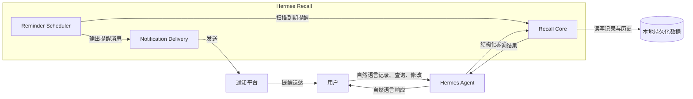
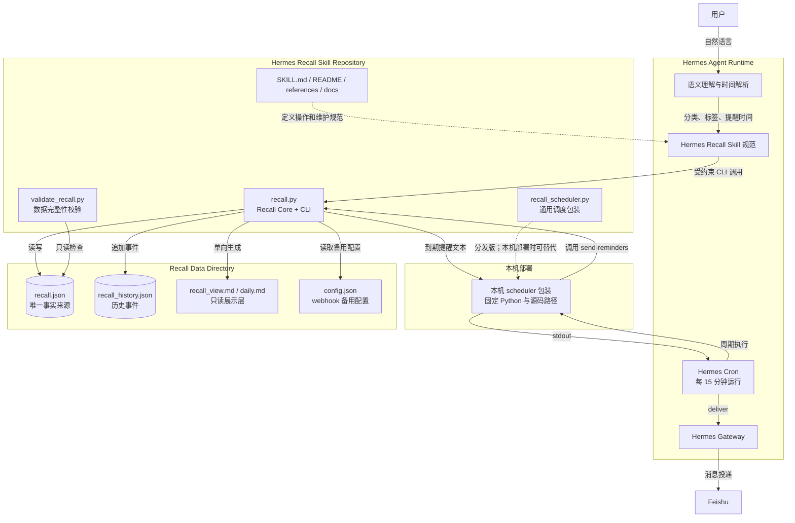
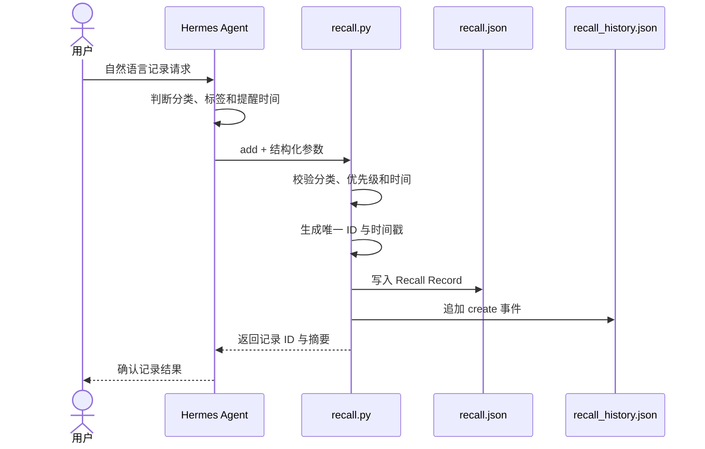
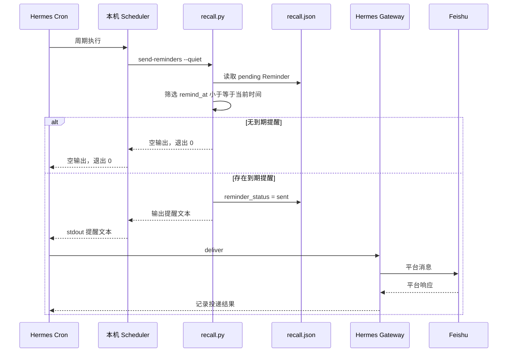
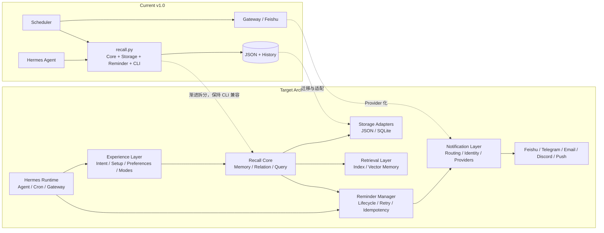
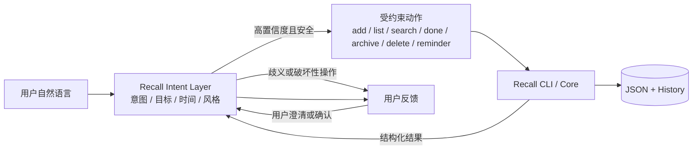

# Hermes Recall（回响）系统架构

> 文档状态：Current + Target
>
> 状态核验日期：2026-08-10
>
> 适用产品基线：v1.0

## 1. 文档目的

本文档定义 Hermes Recall 的系统边界、当前架构、核心组件职责、关键数据流和目标演进方向。

本文档同时描述两种状态：

- **Current**：与产品基线 v1.0 源码和本地运行状态一致；
- **Target**：已经明确方向、但尚未完全实现的目标架构。

除非章节明确标记为 Target，否则“当前架构”均指已经存在的实现。远期想法不能仅因出现在架构图中就被视为现有能力。

本文档不展开完整字段定义、版本迁移步骤、路线排期和测试用例，相关内容由数据模型、开发路线图和测试计划分别管理。

## 2. 架构目标

Hermes Recall 的架构需要同时满足以下目标：

1. **可靠记录**：用户原始内容能够长期保存、查询和追溯；
2. **职责清晰**：语义理解、数据存储、到期调度和平台通知相互分离；
3. **低打扰**：没有明确时间的信息只保存，不主动创建提醒；
4. **数据安全**：升级时优先保证原始内容、既有记录和历史事件不丢失；
5. **渐进演进**：当前使用轻量 JSON，后续可以迁移到 SQLite 和语义检索；
6. **通知可扩展**：Recall Core 不绑定单一通知平台；
7. **产品可用**：内部架构复杂度最终应由 Experience Layer 封装，不转嫁给普通用户。

## 3. 系统边界

### 3.1 系统上下文图



### 3.2 边界内职责

Hermes Recall 负责：

- Recall 记录的持久化；
- CRUD、搜索、状态和优先级管理；
- Reminder 数据的保存和到期判断；
- 历史事件记录；
- Markdown View 生成；
- 旧数据迁移和 Schema upgrade；
- Scheduler 调用所需的命令接口；
- 当前 Feishu webhook 备用发送能力。

### 3.3 边界外职责

以下能力由 Recall 之外的组件负责：

- Hermes Agent 负责理解用户语义、选择分类、生成标签和解析提醒时间；
- Hermes cron 负责周期性运行 scheduler；
- Hermes Gateway 负责将 scheduler 输出投递到已配置平台；
- Feishu 等外部平台负责最终消息传输和展示；
- GitHub、SkillHub 负责代码托管与分发，不属于运行时架构。

### 3.4 边界约束

- Recall Core 不应直接理解平台账号体系；
- 外部通知平台不能成为 Recall 数据的事实来源；
- Markdown View 不能反向覆盖 JSON；
- Hermes 的语义判断结果必须通过受约束的 CLI 参数进入 Recall；
- 调度器不能绕过 Recall 的状态筛选直接构造业务记录。

## 4. 当前总体架构（Current）

### 4.1 当前组件图



### 4.2 当前架构说明

当前实现采用“Skill 仓库 + 独立数据目录 + Hermes 调度基础设施”的组合：

- Skill 仓库保存代码、操作规范和项目文档；
- 数据目录保存用户数据、历史事件、视图和备用配置；
- Hermes cron 周期运行本机 scheduler；
- scheduler 调用 `recall.py send-reminders`；
- 有到期提醒时，脚本输出用户可读消息；
- cron 将 stdout 交给 Hermes Gateway；
- Gateway 负责向 Feishu 投递。

这种结构使源码发布包不携带用户数据，同时允许本机部署针对 Python 路径和运行环境进行适配。

## 5. 当前组件职责（Current）

### 5.1 Hermes Agent

职责：

- 理解用户意图；
- 判断操作类型，例如新增、查询、更新、完成或删除；
- 选择固定分类；
- 生成标签；
- 将自然语言时间转换为带时区的 ISO 8601 时间；
- 调用 Recall CLI；
- 将 CLI 结果转述给用户。

不负责：

- 直接编辑 `recall.json`；
- 直接编辑 Markdown View；
- 自行生成记录 ID；
- 绕过 CLI 修改 Reminder 状态。

### 5.2 Hermes Recall Skill

`SKILL.md` 是 Agent 的操作规范，定义：

- 何时使用 Recall；
- 五分类规则；
- 时间解析原则；
- CLI 调用方式；
- Reminder 与任务状态约束；
- 数据目录优先级；
- 维护和发布注意事项。

Skill 规范负责约束 Agent 行为，不承担运行时数据存储。

### 5.3 Recall Core 与 CLI

当前由 `scripts/recall.py` 统一实现，包含：

- 数据文件加载与保存；
- 唯一 ID 生成；
- CRUD 与关键词搜索；
- 状态、标签和优先级更新；
- History Event 写入；
- Markdown View 生成；
- 到期 Reminder 筛选；
- webhook 备用发送；
- Markdown 迁移；
- Schema upgrade；
- 统计命令。

当前它同时承担 Core、Storage Adapter、Reminder Manager 和 CLI Adapter 多种职责。对于 v1.0 体量这是可接受的，但随着结构化记忆和多平台通知增加，需要在保持 CLI 兼容的前提下逐步拆分内部模块。

### 5.4 JSON Storage

`recall.json` 是当前唯一事实来源，保存顶层版本和 Recall Records。

当前存储层特点：

- 本地文件；
- UTF-8 JSON；
- 写入后整体覆盖文件；
- 适合早期个人数据规模；
- 不适合高并发写入；
- 尚无事务、索引和数据库级约束。

完整字段和约束由 `03-数据模型.md` 管理。

### 5.5 History Store

`recall_history.json` 保存创建、更新、完成、删除和提醒等事件，用于保留操作轨迹。

当前 History Store 是附属审计记录，不是恢复主数据的事件溯源系统。主数据仍以 `recall.json` 为准。

### 5.6 Markdown View

`recall_view.md` 和按需生成的其他 Markdown 文件属于展示层。

数据流只允许：

```text
recall.json → Markdown View
```

不允许：

```text
Markdown View → recall.json
```

旧 Markdown 导入属于显式 Migration 流程，与手工维护展示层是不同概念。

### 5.7 Scheduler Wrapper

仓库内的 `scripts/recall_scheduler.py` 是可分发的通用包装脚本，使用当前 Python 解释器并相对定位 `recall.py`。

本机部署脚本使用固定 Python 与源码绝对路径，目的是消除 cron 环境中的解释器和路径不确定性。它属于部署适配层，不应把本机路径写回通用分发脚本。

### 5.8 Hermes Cron

Hermes cron 负责：

- 按固定周期执行 scheduler；
- 接收脚本 stdout；
- 在脚本非零退出时记录错误；
- 将非空输出交给配置的 delivery 通道；
- 保存运行和投递状态。

当前采用统一 cron，而不是每条 Reminder 创建一个 cron job。

### 5.9 Hermes Gateway

Gateway 负责平台连接和消息投递。Recall 不持有 Gateway 的平台凭据，也不直接处理 Feishu 的会话协议。

### 5.10 Feishu webhook 备用通道

当 `config.json` 中配置 webhook 时，`recall.py` 可以绕过 Gateway 直接调用 Feishu webhook。

该能力是当前兼容通道，不代表已经建立标准化 Notification Provider Interface。长期架构需要将 Gateway delivery 与 webhook Provider 纳入统一通知抽象。

### 5.11 Validator

`validate_recall.py` 只读检查当前 JSON 的基础完整性，包括：

- JSON 可解析；
- ID 唯一；
- `created_at` 存在；
- 分类合法；
- 任务状态合法；
- Reminder 状态合法；
- `needs_reminder` 与 `remind_at` 一致。

Validator 不自动修复数据，Schema upgrade 由独立命令负责。

## 6. 核心数据流（Current）

### 6.1 新增记录



关键约束：

- `content` 保留用户原始表达；
- 有明确 `remind_at` 才将 `needs_reminder` 设为 `true`；
- ID 由 Core 生成；
- 写入主数据后记录历史事件。

### 6.2 查询与更新

查询过程由 Hermes 选择 `list`、`get`、`search` 或 `stats` 命令，Core 从 JSON 读取并返回结构化或文本结果。

更新过程必须先按 ID 定位记录，再校验允许修改的字段。`id` 和 `created_at` 不可通过 update 修改；成功更新后只刷新 `updated_at` 并追加历史事件。

### 6.3 Markdown View 生成

Core 读取 `recall.json`，过滤不需要展示的记录，按分类组织内容，并覆盖写入目标 Markdown 文件。

展示层生成失败不应改变主数据。

## 7. Reminder 端到端流程（Current）

### 7.1 Gateway 调度时序图



### 7.2 到期筛选条件

当前 Reminder 被视为到期，需要同时满足：

```text
needs_reminder = true
AND reminder_status = pending
AND remind_at <= 当前时间
```

无到期提醒时，scheduler 保持空输出，使 cron 静默运行。

### 7.3 当前可靠性边界

Gateway 模式下，Core 在输出提醒文本时先把 Reminder 设为 `sent`，cron 随后才执行外部投递。因此：

- `sent` 当前更接近“已交给 cron delivery”，不等同于平台确认送达；
- cron 的 delivery 状态是核验实际投递结果的重要依据；
- 如果平台投递失败，Recall Record 不会自动恢复为 `pending`；
- 当前没有自动 retry、attempts 或 `last_error` 回写机制。

这个边界是 Target 架构需要优先解决的技术问题。

### 7.4 webhook 备用流程

配置 webhook 时，Core 直接发送到 Feishu：

```text
Recall Core → Feishu webhook → 平台响应
```

成功时标记 `sent`，失败时标记 `failed`。这一流程能够获得发送接口响应，但仍未建立跨平台统一的 Provider Contract。

## 8. 部署架构（Current）

### 8.1 代码与数据分离

当前部署遵循：

```text
Skill Repository ≠ User Data Directory
```

代码仓库可以更新、发布和重新安装；用户数据保存在独立目录，不应随 Skill 包提交到 GitHub 或 SkillHub。

### 8.2 数据目录解析

当前通用代码按以下优先级解析数据目录：

1. `HERMES_RECALL_DIR` 环境变量；
2. Windows 既有部署目录；
3. 用户目录下的通用默认路径。

架构原则是优先支持显式配置，同时兼容既有部署。具体本机绝对路径由部署运维文档管理，不作为通用架构要求。

### 8.3 通用版与本机部署版

- 通用 scheduler 随 Skill 分发，使用相对路径；
- 本机 scheduler 可以固定解释器和源码位置；
- 两者业务语义必须保持一致；
- 本机部署差异应限制在路径、解释器和环境适配，不复制或修改 Reminder 业务规则。

## 9. 安全、隐私与可靠性边界

### 9.1 隐私边界

- 用户数据和历史事件不得提交到公开仓库；
- 通知目标、Token、Webhook 和平台凭据不得进入项目文档；
- 日志与测试样本不得包含真实客户、联系人或备忘录；
- 示例必须使用虚构内容。

### 9.2 数据写入边界

- 所有业务数据修改通过 Core/CLI 执行；
- 不直接手工编辑 `recall.json`；
- View 生成过程不能反向修改主数据；
- Upgrade 只能执行明确、可验证的兼容迁移；
- 迁移前应具备备份与失败恢复策略。

### 9.3 失败边界

当前系统需要区分：

- Core 命令失败；
- JSON 读取或写入失败；
- scheduler 进程失败；
- cron 执行失败；
- Gateway 投递失败；
- 外部平台拒绝或超时。

这些错误不能被统一解释为“提醒失败”，因为对应的修复和重试位置不同。

## 10. 目标架构（Target）

### 10.1 目标分层

目标架构分为四个主要层次：

1. **Experience Layer**：面向用户的自然语言意图、Setup、默认配置、偏好和模式；
2. **Recall Core**：记录、结构化记忆、关联、查询、状态和历史；
3. **Reminder & Notification Layer**：提醒事件、调度、路由、身份和 Provider；
4. **Storage & Retrieval Layer**：JSON、SQLite、迁移、索引和 Vector Memory。

Hermes Agent 是主要交互入口，Hermes cron/Gateway 是外部运行基础设施，不应与 Recall Core 内部模块混为一层。

### 10.2 Current → Target 演进图



### 10.3 Experience Layer

目标职责：

- Recall Intent Layer；
- 首次安装和 Setup Wizard；
- 默认配置；
- 用户偏好；
- Simple Mode；
- Personal Mode；
- 隐藏 Provider、Identity、Schema 和 Migration 等内部概念。

该层不能复制 Core 业务规则，只负责将用户意图和选择转换为明确、受约束的配置与命令。

#### 10.3.1 Recall Intent Layer（Target，FEAT-V11-001）

Recall Intent Layer 是产品 v1.1 的目标子组件，负责让“回响式表达”和现有直白表达进入同一条执行链。它不新增第二套 Core，也不直接持久化用户数据。



目标职责：

- 识别新增、查看、搜索、完成、归档、删除和 Reminder 意图；
- 从表达中分离交互引导语与需要保存的原始 `content`；
- 解析目标记录、筛选条件和个人未来提醒时间；
- 将“落幕”“归档”“删除”等语义映射为互不混淆的领域动作；
- 在目标不唯一、动作不明确或置信度不足时请求澄清；
- 对删除、批量状态变更等破坏性操作建立确认门；
- 将 Core 返回结果渲染为明确、可扫描的回响式或直白反馈；
- 区分个人 Reminder 与系统轮询、看门狗等自动化机制。

边界约束：

- Intent Layer 只能调用公开、受约束的 Recall 动作，不能直接编辑 JSON、History 或 Markdown View；
- 回响式和直白表达必须共用同一组 Core 命令、校验和 History Event；
- `style` 只影响反馈呈现，不进入 Record 事实字段，也不改变动作语义；
- 原始 `content` 不得因反馈风格被总结、润色或文学化改写；
- 查看操作默认只读；删除和批量变更不能仅凭置信度自动执行；
- 明确时间解析仍必须满足 Reminder Contract，Intent Layer 不能绕过“无明确时间则不提醒”的规则；
- 该层是 Experience Layer 的 Target 能力，不代表 v1.0 Current 已经支持完整词表和安全确认流程。

建议的内部意图结果是稳定的结构化对象，而不是把自然语言直接拼接成 shell 命令。例如：

```json
{
  "intent": "add",
  "content": "周五下午整理项目复盘材料",
  "target": null,
  "reminder": null,
  "style": "echo",
  "requires_confirmation": false
}
```

该对象只描述交互决策，不是新的持久化 Schema。字段名称和最终 Contract 应在实现前结合测试冻结。

### 10.4 Recall Core

目标职责：

- Recall Record 生命周期；
- 结构化记忆元数据；
- 关联记录；
- 主题和上下文查询；
- History Event；
- 对 Storage 与 Retrieval 提供稳定领域接口。

Core 不直接依赖 Feishu、Telegram 等平台 SDK。

### 10.5 Reminder Manager

目标职责：

- Reminder 领域模型；
- 到期触发；
- 状态机；
- 幂等键；
- 重试策略；
- attempts 与 `last_error`；
- 发送成功和平台送达状态区分。

目标状态机需要在专项设计中确定，不能只从原始提示词直接照搬。

### 10.6 Notification Layer

目标组成：

- Provider Interface；
- Identity Mapping；
- Routing Strategy；
- Provider Config；
- Delivery Result；
- Feishu Provider；
- 后续 Telegram、Email、Discord 和 Mobile Push Provider。

Recall Core 只表达提醒需求，不直接决定最终平台。

### 10.7 Storage Adapters

目标是使 Core 通过稳定接口访问存储：

```text
Recall Core → Storage Interface → JSON Adapter / SQLite Adapter
```

JSON 在早期继续作为默认实现。只有数据规模、查询能力或可靠性要求达到迁移条件时，才引入 SQLite。

### 10.8 Retrieval Layer

目标职责：

- 关键词索引；
- 主题聚合；
- 关系查询；
- 未来 Vector Memory；
- 语义召回候选生成。

Retrieval 结果不能未经验证自动覆盖主数据，只能用于查询、建议或显式更新流程。

## 11. 架构演进原则

### 11.1 先稳定接口，再拆分模块

当前 `recall.py` 集中实现多个职责。后续不应为了形式上的分层一次性重写，而应先明确领域接口和测试，再逐步提取：

1. Storage Adapter；
2. Reminder Manager；
3. Notification Provider；
4. Retrieval Layer；
5. Experience Layer，其中先建立 Recall Intent Layer，再逐步补充 Setup、Preferences 与 Modes。

### 11.2 保持 CLI 兼容

内部模块拆分时，应尽量保持现有 CLI 命令和关键参数兼容。确需破坏兼容时，必须：

- 说明影响范围；
- 提供迁移命令；
- 更新 Skill 规范；
- 增加回归测试；
- 明确产品、Skill 和 Schema 版本变化。

### 11.3 不提前接入所有平台

Notification Ecosystem 的第一目标是建立可验证的接口和投递结果模型，而不是同时实现所有 Provider。

Feishu 应作为首个兼容实现。新平台只有在统一接口、身份模型和测试契约稳定后再接入。

### 11.4 不提前迁移数据库

JSON 仍适合当前阶段。SQLite 和 Vector Memory 应由真实数据规模、查询需求和可靠性问题驱动，而不是只因路线文档中出现就立即实施。

### 11.5 Current 与 Target 同步维护

每次架构变更完成后：

- 更新 Current 组件和数据流；
- 将已经实现的 Target 调整为 Current；
- 在开发路线图中更新阶段状态；
- 在测试计划中补充回归用例；
- 必要时新增 ADR 记录重大决策。

## 12. 关键架构决策摘要

当前已经形成但尚待 ADR 正式归档的决策包括：

| 决策 | 当前结论 | 主要理由 |
|---|---|---|
| 当前主存储 | JSON | 轻量、可读、适合早期个人数据规模 |
| 展示层 | JSON 单向生成 Markdown | 防止双事实来源和数据漂移 |
| 调度方式 | 统一 Scheduler | 避免每条 Reminder 建立独立 cron |
| 通知边界 | Recall 与平台投递分离 | 支持 Gateway 和未来 Provider 扩展 |
| 代码与数据 | 分目录保存 | 更新和发布源码时不携带用户数据 |
| 演进方式 | 渐进拆分 | 降低重写风险并保持现有 CLI 可用 |

这些摘要不替代 ADR。只有在 `docs/adr/` 中经过评审并标记为 Accepted 的记录，才是完整的架构决策档案。

## 13. 当前架构验收基线

产品基线 v1.0 的架构可视为成立，需要满足：

- Hermes 能通过 Skill 规范调用 Recall CLI；
- JSON 继续作为唯一事实来源；
- History Event 与主记录分离保存；
- Markdown View 可由 JSON 单向生成；
- Reminder 由统一 Scheduler 周期检查；
- 无到期提醒时调度保持静默；
- 到期提醒可以通过当前 Gateway/Feishu 链路投递；
- 数据完整性校验能够发现基础 Schema 问题；
- 用户数据、凭据和通知目标不进入公开源码仓库。

目标架构中的结构化记忆、标准 Provider、多平台路由、SQLite 和 Vector Memory，不属于 v1.0 架构验收范围。
