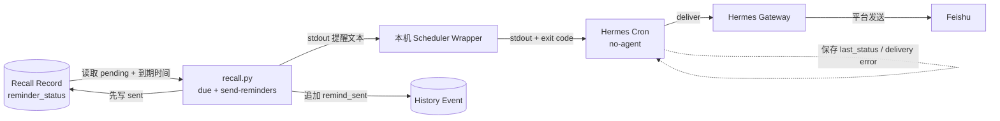
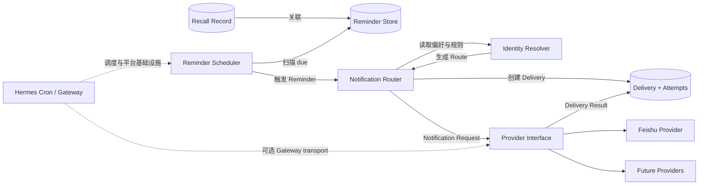
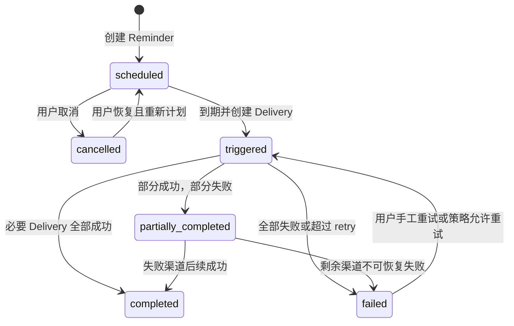
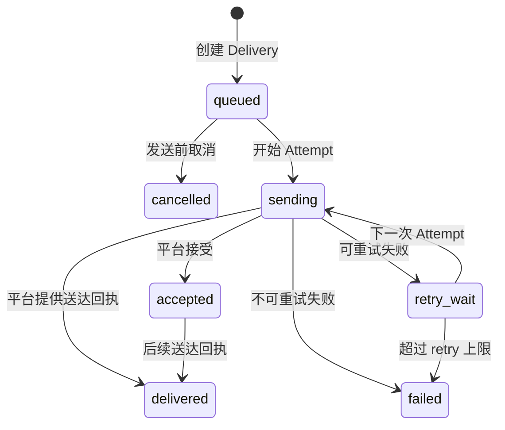

# Hermes Recall（回响）Reminder 与 Notification 专项设计

> 文档状态：Current + Target
>
> 状态核验日期：2026-08-10
>
> 当前产品基线：v1.0
>
> 目标产品阶段：v1.4 Notification Ecosystem 基础、v1.5 可靠智能 Reminder

## 1. 文档目的

本文档定义 Hermes Recall 的 Reminder、Scheduler、Notification、Identity、Routing、Provider、Delivery Result、配置和健康检查边界。

本文档重点解决：

- 当前 Reminder 和 Feishu 投递链路实际如何工作；
- Reminder 状态与任务状态、cron 状态、Delivery 状态如何区分；
- 为什么当前 `sent` 不等同于平台确认送达；
- 多平台能力应如何扩展而不绑定 Recall Core；
- 如何兼容当前单渠道 Feishu 使用方式；
- v1.4 与 v1.5 分别应该完成什么；
- 哪些 Contract 可以先确定，哪些仍需实施前评审。

本文档是专项设计，不表示 Target 已经实现。Current 与 Target 必须分别理解。

## 2. 设计目标

### 2.1 当前目标

维持 v1.0 的基础提醒闭环：

```text
Recall Record
→ 统一 Scheduler
→ Hermes Cron
→ Hermes Gateway
→ Feishu
```

并诚实记录当前状态语义和可靠性边界。

### 2.2 v1.4 目标

建立 Notification Ecosystem 的最小稳定基础：

- Provider Interface；
- Identity Contract；
- Delivery Result Contract；
- Config 边界；
- Feishu 兼容实现；
- Provider 健康检查；
- 新 Provider 契约测试。

v1.4 的目标不是一次接入所有平台。

### 2.3 v1.5 目标

建立可靠 Reminder 生命周期：

- Reminder 与 Delivery Attempt 分离；
- 明确投递状态语义；
- attempts 与错误记录；
- 幂等与防重复；
- 可控 retry；
- cron/Gateway 结果回写；
- 基于历史的提醒建议，但不静默创建高打扰提醒。

## 3. 核心原则

### 3.1 Recall Core 不绑定平台

Recall Core 只表达：

- 需要提醒什么；
- 何时提醒；
- Reminder 是否有效；
- 与哪条 Record 相关。

Recall Core 不应直接理解 Feishu `chat_id`、Telegram `chat_id`、Discord `channel_id` 或 Email address。

### 3.2 Reminder 不等于 Delivery

Reminder 表达“提醒意图”，Delivery 表达“一次向某个目标发送的尝试”。

一条 Reminder 可以没有 Delivery、产生一次 Delivery，或在未来产生多次重试和多渠道 Delivery。

### 3.3 调度不等于通知

Scheduler 判断 Reminder 是否到期；Provider 负责调用平台。Scheduler 不应包含平台协议代码。

### 3.4 平台接受不等于用户实收

不同平台提供的回执能力不同。状态命名必须反映实际证据，不能将 HTTP 200、Gateway 接受或脚本输出统一写成 `delivered`。

### 3.5 单渠道体验优先

普通用户默认只需要一个通知目标。多渠道是显式高级能力，不应迫使所有 Records 迁移到复杂配置。

### 3.6 配置与凭据分离

平台启用状态、默认目标和路由规则属于配置；App Secret、Token、Webhook 等属于凭据。凭据不得进入 Recall Record、公开文档或测试夹具。

### 3.7 幂等优先于盲目重试

没有幂等设计时自动 retry 可能制造重复提醒。必须先定义 Delivery ID、重试条件和状态恢复，再启用自动 retry。

## 4. 术语

| 术语 | 定义 |
|---|---|
| Recall Record | 用户保存的原始记录及其业务字段 |
| Reminder | 与 Record 关联的提醒意图和计划时间 |
| Scheduler | 发现到期 Reminder 并触发派发的组件 |
| Notification Request | 向 Notification Layer 发出的平台无关发送请求 |
| Route | 将 Reminder 映射到渠道和目标的结果 |
| Identity | 平台无关封装的通知目标身份 |
| Provider | 针对具体平台执行发送的适配器 |
| Delivery | 针对一个 Route 的逻辑投递 |
| Delivery Attempt | Delivery 的一次具体发送尝试 |
| Delivery Result | Provider 对一次 Attempt 返回的结构化结果 |
| Cron Runtime | Hermes cron 的任务执行和 delivery 基础设施 |
| Gateway | Hermes 的消息平台连接与发送基础设施 |

## 5. 当前链路（Current）

### 5.1 Current 组件图



### 5.2 Current 到期条件

当前 Reminder 进入发送流程，需要同时满足：

```text
needs_reminder = true
AND reminder_status = pending
AND remind_at <= 当前时间
```

当前 `reminder_status` 允许：

```text
pending / sent / failed / cancelled
```

### 5.3 Current Gateway 模式

当 `config.json.feishu_webhook_url` 为空：

1. `recall.py send-reminders` 筛选到期 Reminder；
2. Core 将 Record 的 `reminder_status` 设为 `sent`；
3. Core 写入 `remind_sent` History Event；
4. Core 输出提醒文本；
5. scheduler wrapper 透传 stdout；
6. cron 将 stdout 交给 delivery；
7. Gateway 向 Feishu 发送；
8. cron 保存运行和投递状态。

关键限制：第 2 步发生在实际平台投递之前。

### 5.4 Current webhook 模式

当 webhook 非空：

1. Core 筛选到期 Reminder；
2. Core 直接发送 Feishu webhook；
3. 成功时设为 `sent`；
4. 失败时设为 `failed`；
5. 失败返回非零退出码。

webhook 响应可以证明平台接口接受或拒绝请求，但通常不能证明用户已经阅读消息。

### 5.5 Current cron 能力边界

Hermes cron 当前可以：

- 周期执行 no-agent 脚本；
- 将脚本 stdout 原样作为投递消息；
- 保存任务 `last_status`；
- 在配置无效时进入 `blocked_config`；
- 保存 delivery 错误；
- 将非空输出投递到明确平台目标。

这些状态属于 Cron Runtime，不属于 Recall Record。

## 6. 当前四层状态边界

当前系统至少存在四类不同状态：

| 层级 | 当前字段或证据 | 回答的问题 |
|---|---|---|
| Record 任务状态 | `status` | 事项是否待处理、进行中、完成或归档 |
| Record Reminder 状态 | `reminder_status` | Reminder 是否 pending、sent、failed 或 cancelled |
| Cron 执行状态 | `last_status`、`blocked_config` 等 | scheduler job 是否成功执行 |
| Cron Delivery 状态 | delivery error、平台发送结果 | cron 是否成功将输出交给目标平台 |

必须避免以下错误推断：

```text
status = 已完成
≠ Reminder 已取消

reminder_status = sent
≠ cron delivery 成功

cron last_status = ok
≠ 用户实收

平台 API 接受
≠ 用户已读
```

## 7. 当前可靠性缺口

### 7.1 状态提前写入

Gateway 模式在实际 delivery 前写入 `sent`。如果后续 Gateway 失败，Record 不会自动恢复为 `pending`。

### 7.2 缺少 Attempt

当前没有独立记录：

- 尝试编号；
- 开始时间；
- 完成时间；
- Provider；
- Target；
- 平台消息 ID；
- 错误分类；
- 是否可重试。

### 7.3 缺少幂等键

无法稳定判断某次 retry 是否已经由平台接受，自动重试可能重复发送。

### 7.4 状态语义过载

`sent` 同时可能表示：

- 已输出给 cron；
- webhook 返回成功；
- 被维护者理解为已送达。

这是三个不同证据层级。

### 7.5 配置分散

当前通知相关信息分布在：

- Recall `config.json`；
- Hermes `config.yaml` 平台启用状态；
- Hermes 凭据环境；
- cron job 的 `deliver`；
- Gateway 运行进程环境。

缺少统一健康检查会造成“平台已连接但 cron 目标不可解析”等配置偏差。

### 7.6 History 语义不完整

`remind_sent` 表示 Core 进入了当前发送路径，不等于平台 delivered。事件名称容易被过度解释。

## 8. Target 总体架构



Target 将领域状态和平台发送证据分开：

- Record：用户信息和任务状态；
- Reminder：计划和生命周期；
- Delivery：某个渠道与目标的逻辑投递；
- Attempt：一次具体调用；
- Cron Runtime：调度进程状态；
- Provider：平台适配。

## 9. Target 领域模型

### 9.1 Reminder Entity

建议方向：Reminder 从 Record 的扁平状态逐步抽象为独立 Entity，至少包含：

```json
{
  "id": "reminder_20260810_a1b2c3",
  "recall_id": "recall_20260810_d4e5f6",
  "schema_version": "target-version",
  "scheduled_at": "2026-08-14T14:00:00+08:00",
  "status": "scheduled",
  "created_at": "2026-08-10T10:00:00+08:00",
  "updated_at": "2026-08-10T10:00:00+08:00",
  "cancelled_at": null,
  "metadata": {}
}
```

这是 Target 示例，不是当前 Schema。

Reminder 负责：

- 关联 Record；
- 计划时间；
- 是否有效；
- 是否已触发；
- 是否已取消；
- 聚合 Delivery 结果。

Reminder 不保存平台凭据。

### 9.2 Delivery Entity

一条 Reminder 在一个 Route 上生成一个 Delivery：

```json
{
  "id": "delivery_20260814_a1b2c3",
  "reminder_id": "reminder_20260810_a1b2c3",
  "channel": "feishu",
  "identity_ref": "identity_default_feishu",
  "status": "queued",
  "idempotency_key": "example-stable-key",
  "attempt_count": 0,
  "last_error": null,
  "created_at": "2026-08-14T14:00:00+08:00",
  "updated_at": "2026-08-14T14:00:00+08:00"
}
```

Delivery 负责：

- 目标渠道；
- 目标身份引用；
- 幂等键；
- 聚合 Attempt 状态；
- 最近错误；
- retry 计数。

### 9.3 Delivery Attempt

每次实际发送产生 Attempt：

```json
{
  "id": "attempt_20260814_001",
  "delivery_id": "delivery_20260814_a1b2c3",
  "attempt_number": 1,
  "status": "accepted",
  "started_at": "2026-08-14T14:00:01+08:00",
  "finished_at": "2026-08-14T14:00:02+08:00",
  "provider_message_id": "synthetic-message-id",
  "retryable": false,
  "error_code": null,
  "error_message": null
}
```

Attempt 保存可诊断证据，不应包含完整凭据或未脱敏平台响应。

### 9.4 为什么不把全部字段放进 Record

如果将多渠道、每次 Attempt、错误和平台身份全部放入 Recall Record，会导致：

- Record 被通知细节污染；
- 一条 Reminder 多次 retry 难以表达；
- 多渠道状态互相覆盖；
- History 体积快速增长；
- Core 与平台耦合；
- 后续 SQLite 迁移更困难。

因此 Target 倾向独立 Entity，但最终存储位置和 Schema 版本仍需实施前冻结。

## 10. Target Reminder 状态机

### 10.1 状态建议

建议 Reminder 使用：

```text
scheduled
triggered
completed
partially_completed
failed
cancelled
```

语义：

| 状态 | 含义 |
|---|---|
| `scheduled` | 等待计划时间 |
| `triggered` | 已到期并创建至少一个 Delivery |
| `completed` | 所有必要 Delivery 达到成功终态 |
| `partially_completed` | 多渠道中部分成功、部分失败 |
| `failed` | 所有必要 Delivery 达到不可恢复失败或超出 retry |
| `cancelled` | 用户或系统明确取消 |

`completed` 的成功条件取决于 Provider 能提供的最高证据级别。不能统一假设是用户已读。

### 10.2 状态图



是否允许 `failed → triggered` 自动发生，取决于幂等和 retry 策略。

### 10.3 与 Record 状态分离

- Record `已完成` 不自动等于 Reminder `cancelled`；
- 产品层应在完成任务时提示仍有 Reminder；
- 用户选择后再取消或保留；
- Record 删除前应明确处理关联 Reminder；
- Record 归档是否取消 Reminder 必须由产品规则确定，不能由存储层猜测。

## 11. Target Delivery 状态机

### 11.1 状态建议

```text
queued
sending
accepted
delivered
retry_wait
failed
cancelled
```

| 状态 | 证据 |
|---|---|
| `queued` | Delivery 已创建，尚未调用 Provider |
| `sending` | Provider 调用进行中 |
| `accepted` | 平台或 Gateway 接受请求，但无送达证据 |
| `delivered` | 平台明确提供送达证据时使用 |
| `retry_wait` | 可重试错误，等待下一次 Attempt |
| `failed` | 不可重试或超过 retry 上限 |
| `cancelled` | 在发送前被取消 |

不是所有 Provider 都能达到 `delivered`。如果 Feishu/Gateway 只能证明请求被接受，成功终态应是 `accepted`，不能虚构 `delivered`。

### 11.2 状态图



### 11.3 成功终态配置

Provider Contract 应声明它能提供的最高确认级别：

```text
request_only
accepted
sent
confirmed_delivery
```

Reminder 聚合状态依据 Provider 能力判断，不把能力不足当成失败，也不把缺失证据当作成功证据。

## 12. Notification Request Contract（Target）

平台无关发送请求建议包含：

```json
{
  "delivery_id": "delivery_20260814_a1b2c3",
  "channel": "feishu",
  "identity": {
    "type": "chat",
    "id_ref": "identity_default_feishu"
  },
  "message": {
    "type": "text",
    "title": "Hermes Recall 提醒",
    "body": "【工作待办】周五下午整理项目复盘材料",
    "metadata": {
      "reminder_id": "reminder_20260810_a1b2c3"
    }
  },
  "idempotency_key": "example-stable-key"
}
```

边界：

- Request 不包含 Provider Secret；
- `identity.id_ref` 引用配置，不把真实目标复制到 Record；
- Message Metadata 只包含必要追踪字段；
- 日志输出时必须脱敏 identity 和正文策略字段。

## 13. Delivery Result Contract（Target）

Provider 返回统一结果：

```json
{
  "provider": "feishu",
  "status": "accepted",
  "provider_message_id": "synthetic-message-id",
  "occurred_at": "2026-08-14T14:00:02+08:00",
  "retryable": false,
  "error": null,
  "raw_response_ref": null
}
```

失败示例：

```json
{
  "provider": "feishu",
  "status": "failed",
  "provider_message_id": null,
  "occurred_at": "2026-08-14T14:00:02+08:00",
  "retryable": true,
  "error": {
    "code": "provider_timeout",
    "message": "Provider request timed out"
  },
  "raw_response_ref": null
}
```

`raw_response_ref` 如果实现，只能引用安全存储中的脱敏诊断信息，不能将完整平台响应写入公开日志。

## 14. Provider Interface（Target）

建议最小接口：

```text
name() -> string
capabilities() -> ProviderCapabilities
validate_config(config) -> ValidationResult
health_check(config) -> HealthResult
send(request, config) -> DeliveryResult
```

### 14.1 `capabilities`

声明：

- 支持的 message type；
- 支持的 identity type；
- 最高确认级别；
- 是否支持 idempotency key；
- 是否支持后续状态查询；
- 是否支持平台 callback；
- 是否支持批量发送。

### 14.2 `validate_config`

只检查配置结构和必需项，不向用户输出完整凭据。

### 14.3 `health_check`

分级建议：

```text
healthy
degraded
blocked_config
unavailable
unknown
```

健康检查不应在每次普通查询时调用外部平台，避免额外网络和限流。

### 14.4 `send`

要求：

- 只接收平台无关 Request；
- 返回统一 Delivery Result；
- 不直接修改 Recall Record；
- 不自行无限 retry；
- 错误必须分类；
- 日志必须脱敏。

## 15. Feishu Provider（Target）

### 15.1 两种 Transport

Feishu Provider 可支持：

1. Hermes Gateway transport；
2. Feishu webhook transport。

两者共享 Message、Identity、Result Contract，但配置和回执能力不同。

### 15.2 Gateway transport

优势：

- 复用 Hermes 平台连接；
- 凭据集中在 Hermes；
- 与其他 Gateway 平台方向一致。

限制：

- Recall 当前无法直接获得平台级消息结果 Contract；
- cron delivery 状态需要桥接回 Delivery Store；
- 手动 cron run 与 Gateway 自然 tick 的环境可能不同；
- 显式目标与 bare 平台目标解析路径不同。

### 15.3 webhook transport

优势：

- Core 当前可直接获得 HTTP 响应；
- 适合本地 fake server 契约测试。

限制：

- webhook 是敏感凭据；
- 与 Gateway 配置形成双轨；
- 通常只能证明平台接口接受；
- 不适合作为所有 Provider 的统一实现方式。

### 15.4 v1.4 兼容要求

- 当前 Feishu Gateway 使用方式继续可用；
- 当前 webhook 使用方式继续可用或提供明确迁移；
- 不要求用户立刻创建 Identity Entity；
- 可以通过默认配置生成兼容 Route；
- 迁移前后提醒内容保持一致；
- 真实目标和凭据不进入 Record。

## 16. Identity Layer（Target）

### 16.1 Identity Contract

建议：

```json
{
  "id": "identity_default_feishu",
  "platform": "feishu",
  "type": "chat",
  "target_ref": "secret-or-config-reference",
  "display_name": "默认通知会话",
  "enabled": true,
  "metadata": {}
}
```

`target_ref` 是配置或秘密引用，不是公开目标值。

### 16.2 平台映射

| 平台 | Identity Type 候选 | 平台原生标识 |
|---|---|---|
| Feishu | `chat`, `user` | chat ID、open ID 等 |
| Telegram | `chat`, `user` | chat ID、user ID |
| Discord | `channel`, `user` | channel ID、user ID |
| Email | `address` | email address |
| Mobile Push | `device`, `topic` | device token、topic |

平台原生标识的真实值不得出现在公开文档和测试夹具。

### 16.3 Identity 解析规则

- Simple Mode 使用一个默认 Identity；
- Personal Mode 可以管理多个 Identity；
- Route 只引用已启用 Identity；
- Identity 不存在或被禁用时进入配置错误，而不是静默回退到未知目标；
- 用户删除 Identity 前，需要检查关联 Route；
- 更换平台原生目标不要求修改 Recall Records。

## 17. Routing Strategy（Target）

### 17.1 路由输入

Router 可以考虑：

- Reminder 明确指定渠道；
- 用户默认渠道；
- category；
- priority；
- 用户打扰偏好；
- Provider 健康状态；
- 时间段；
- 是否允许 fallback。

### 17.2 路由优先级建议

```text
显式 Reminder Route
→ 用户针对类别的偏好
→ 用户默认渠道
→ Simple Mode 默认 Identity
→ 配置错误
```

不能在没有任何有效目标时静默选择未知平台。

### 17.3 单渠道默认

默认生成一个 Route：

```text
一条 Reminder → 一个 Delivery → 一个默认 Identity
```

多渠道只有用户明确启用时才生成多个 Delivery。

### 17.4 多渠道聚合

需要明确：

- all：所有必要渠道成功才完成；
- any：任一渠道成功即完成；
- fallback：主渠道失败后才尝试备用渠道。

默认不应使用 all，以免增加打扰和重复提醒。

### 17.5 健康状态不应擅自改路由

Provider degraded 时是否 fallback 必须由用户策略决定。系统不能因短暂异常把私人提醒发送到用户未确认的平台。

## 18. Notification Config（Target）

### 18.1 配置分层

建议分为：

1. Recall Notification Preferences
   - 默认渠道；
   - 类别规则；
   - quiet hours；
   - retry 偏好；
   - 多渠道策略。

2. Hermes Platform Config
   - 平台是否启用；
   - Gateway 连接模式；
   - 平台能力。

3. Secrets
   - App ID；
   - App Secret；
   - Token；
   - webhook；
   - 平台原生目标的敏感引用。

### 18.2 配置一致性

健康检查需要验证：

- Route 使用的平台已启用；
- Identity 存在且启用；
- Provider 必需凭据可解析；
- cron job 处于启用状态；
- scheduler 脚本存在；
- delivery 目标可解析；
- Gateway 当前运行或 transport 可用；
- Recall 数据可读；
- 时间和时区有效。

### 18.3 配置错误行为

- 标记为 `blocked_config` 或等价状态；
- 不创建无意义 retry；
- 不重复发送同一错误提醒；
- 提供可操作修复信息；
- 不泄露凭据；
- 修复后允许恢复正常调度。

## 19. Scheduler Contract（Target）

Scheduler 负责：

1. 使用明确 `now` 查找 due Reminder；
2. 原子声明 Reminder 的触发权，防止并发重复；
3. 为 Route 创建 Delivery；
4. 将 Notification Request 交给 Notification Layer；
5. 根据 Delivery 聚合结果更新 Reminder；
6. 记录可诊断事件；
7. 无到期 Reminder 时静默。

Scheduler 不负责：

- 解析用户自然语言；
- 决定平台协议；
- 直接读取平台 Secret；
- 无限重试；
- 把 stdout 存在视为 delivered；
- 自动选择用户未授权目标。

## 20. 幂等设计（Target）

### 20.1 幂等目标

同一个 Reminder、同一个计划时间、同一个 Route，不应因：

- cron 重复 tick；
- 进程重启；
- 网络超时；
- Gateway 重复提交；
- 手动 run 与自然 tick 重叠

产生无法控制的重复提醒。

### 20.2 幂等键候选

```text
hash(reminder_id + scheduled_at + route_id + message_revision)
```

是否使用 hash、数据库唯一约束或 Provider 原生 key，需要实施时确定。

### 20.3 Message Revision

如果 Reminder 内容在触发后被修改，需要明确：

- 旧 Delivery 是否取消；
- 新内容是否产生新 revision；
- retry 使用旧快照还是最新内容；
- 用户是否会收到两条不同消息。

默认建议：Delivery 创建时冻结 Message Snapshot，后续 retry 使用同一 snapshot，避免一次逻辑投递内容漂移。

## 21. Retry 策略（Target）

### 21.1 错误分类

至少区分：

- `blocked_config`：配置缺失，不自动高频 retry；
- `authentication_failed`：凭据错误，需要人工修复；
- `rate_limited`：按 Provider 建议等待；
- `provider_timeout`：可有限 retry；
- `network_unavailable`：可有限 retry；
- `invalid_target`：通常不可 retry；
- `payload_rejected`：修复内容或 Provider 后再试；
- `unknown`：保守处理并要求诊断。

### 21.2 retry 规则

- 只对明确 retryable 错误重试；
- 必须有最大次数；
- 使用退避；
- 每次 retry 创建新的 Attempt，不覆盖旧 Attempt；
- retry 前检查 Delivery 是否已经 accepted/delivered；
- 超过上限转为 failed；
- 用户可以手工重试；
- 手工重试同样遵守幂等。

### 21.3 默认策略

在幂等和 Attempt Store 完成前，不启用自动 retry。v1.0 继续使用手工重置 `pending` 的保守方式。

## 22. Message Contract

### 22.1 Current 文本

当前提醒至少包含：

- 产品名称；
- category；
- content；
- 提醒时间；
- 创建时间。

### 22.2 Target 消息原则

- 保留足够上下文识别事项；
- 不包含内部 ID，除非高级诊断需要；
- 不暴露 Provider、Schema 或路由细节；
- 过长 content 应安全截断并提供查询入口；
- 多渠道内容允许平台格式适配，但语义一致；
- 错误消息与用户提醒分开；
- 不在通知中泄露不必要的敏感 metadata。

### 22.3 消息快照

Delivery 应保存或引用发送时的脱敏 Message Snapshot，以便诊断“发送了什么”，但要评估隐私、历史保留和数据体积。

## 23. History 与审计（Target）

建议事件：

```text
reminder_created
reminder_rescheduled
reminder_triggered
reminder_cancelled
delivery_created
delivery_attempt_started
delivery_accepted
delivery_delivered
delivery_retry_scheduled
delivery_failed
```

约束：

- 事件名称对应实际证据；
- 不再用 `remind_sent` 同时表示多个层级；
- Event Contract 应有版本；
- 错误事件脱敏；
- 历史保留策略需要与用户数据删除权一致；
- Audit Event 不替代当前状态 Store。

## 24. 健康检查（Target）

### 24.1 检查层级

| 层级 | 检查内容 |
|---|---|
| Data | 主数据、Reminder、Delivery Store 可读写，Schema 合法 |
| Scheduler | cron job 存在、启用、脚本存在、最近运行状态 |
| Routing | 默认 Route 可解析，规则无冲突 |
| Identity | Identity 存在、启用、类型与 Provider 匹配 |
| Provider | 配置完整、凭据可解析、能力可用 |
| Gateway | 进程状态和平台连接状态 |
| Delivery | 最近错误、积压、重复和超时 Attempt |

### 24.2 健康状态

```text
healthy
warning
degraded
blocked_config
unavailable
unknown
```

### 24.3 用户输出

Simple Mode 只显示：

- 正常；
- 需要配置；
- 暂时不可用；
- 有提醒发送失败。

Personal Mode 可以查看组件级诊断，但不能显示完整凭据。

## 25. 多平台扩展指南（Target）

新增 Provider 的步骤：

1. 定义平台支持的 Identity Type；
2. 实现 `capabilities`；
3. 实现配置校验；
4. 实现健康检查；
5. 实现 `send`；
6. 将平台响应映射为统一 Delivery Result；
7. 明确最高确认级别；
8. 定义 retryable 错误；
9. 增加 Provider Contract Tests；
10. 增加 Identity Mapping Tests；
11. 增加脱敏日志测试；
12. 更新用户配置文档；
13. 不修改 Recall Core 的 Record 业务逻辑。

上线新 Provider 前必须先使用 synthetic identity 和 fake transport 完成测试，再进行用户明确同意的真实端到端验证。

## 26. 兼容与迁移

### 26.1 v1.0 兼容目标

当前 Records 包含：

```text
needs_reminder
remind_at
reminder_status
```

v1.4/v1.5 迁移不能要求用户手工重建全部 Reminder。

### 26.2 兼容层建议

迁移期间可以：

1. 读取旧扁平字段；
2. 为有 Reminder 的 Record 生成独立 Reminder Entity；
3. 保留原 `remind_at`；
4. 将 `pending` 映射为 `scheduled`；
5. 将 `cancelled` 映射为 `cancelled`；
6. 对旧 `sent` 标记为 `legacy_sent` 或迁移 metadata，不伪装为 delivered；
7. 对旧 `failed` 记录保守映射并要求人工检查；
8. 完成核对后再决定是否移除旧字段。

### 26.3 双写风险

不建议长期同时维护旧扁平状态和新 Reminder Store。短期双写必须：

- 定义单一写入入口；
- 明确哪个 Store 是事实来源；
- 检测不一致；
- 有退出双写的版本计划；
- 提供回滚。

### 26.4 Migration 门禁

- 生产数据备份；
- dry-run；
- Record 与 Reminder 数量核对；
- 时间和状态映射报告；
- 旧 sent/failed 人工核对；
- 新旧查询结果对比；
- 回滚验证；
- 用户验收。

## 27. 测试要求

与 `05-测试计划.md` 对齐，专项测试至少覆盖：

### 27.1 Reminder

- 到期边界；
- 时区；
- 取消与恢复；
- Record 完成后的处理；
- 多 Scheduler 并发声明；
- 重复 tick 幂等。

### 27.2 Provider

- Contract Tests；
- 配置缺失；
- authentication failure；
- timeout；
- rate limit；
- invalid target；
- accepted 与 delivered 区分；
- 日志脱敏。

### 27.3 Routing 与 Identity

- 默认 Identity；
- 显式 Route；
- 禁用 Identity；
- 未知平台；
- all/any/fallback；
- Provider degraded 时的用户策略。

### 27.4 Delivery

- Attempt 追加；
- retry 上限；
- 幂等键；
- 进程重启恢复；
- Gateway 结果回写；
- 多渠道聚合；
- Message Snapshot 稳定。

### 27.5 端到端

- fake transport 默认执行；
- 真实 Feishu 需用户明确同意；
- cron `ok`、delivery error、Provider Result 和人工实收分别核验；
- 测试数据隔离和清理。

## 28. 隐私与安全

- Provider Secret 不进入 Request；
- Identity 原生值不进入 Record；
- 日志默认脱敏目标和凭据；
- 测试夹具使用 synthetic identity；
- Message Snapshot 的保留期可配置；
- 删除用户数据时处理 Reminder、Delivery、Attempt 和审计引用；
- 多渠道必须经过用户授权；
- fallback 不能把消息发送到未确认平台；
- 健康检查不能输出完整凭据；
- 公开文档不包含真实平台标识。

## 29. v1.4 完成标准

v1.4 Notification Ecosystem 基础完成，需要：

- Provider Interface 冻结；
- Identity Contract 冻结；
- Delivery Result Contract 冻结；
- Feishu Gateway/webhook 通过兼容层工作；
- 新增第二个 fake Provider 不修改 Recall Core；
- Config 一致性检查可执行；
- Provider 健康检查可执行；
- 当前 Feishu 使用不受破坏；
- 未实现平台不宣称可用；
- Contract Tests 和回归测试通过；
- 文档和 Migration 方案完成；
- 用户验收。

v1.4 不要求自动 retry、完整 delivered 回写或全部平台上线。

## 30. v1.5 完成标准

v1.5 可靠智能 Reminder 完成，需要：

- 独立 Reminder、Delivery 和 Attempt Contract；
- 幂等键和并发触发保护；
- 明确的 Reminder 与 Delivery 状态机；
- retry 错误分类、退避和上限；
- cron/Gateway 结果能够回写或被统一查询；
- 不再把脚本 stdout 直接等同于平台送达；
- 每次 Attempt 可追踪；
- 失败原因可见且脱敏；
- Record 完成、归档、删除与 Reminder 的产品规则冻结；
- 故障注入和端到端测试通过；
- 智能建议默认不静默创建 Reminder；
- 用户验收。

## 31. 待决策问题

实施前仍需单独确认：

1. Reminder 是否在 JSON 中独立集合，还是直接迁移 SQLite；
2. Delivery/Attempt 是否与 Reminder 使用同一 Store；
3. Feishu Gateway 如何提供可持久化 Delivery Result；
4. Provider 成功终态对 Feishu 应定义为 accepted 还是 delivered；
5. 是否需要平台 callback 或状态查询；
6. 多渠道默认使用 any、all 还是 fallback；
7. `quiet hours` 如何影响已经到期的 Reminder；
8. Record 完成和归档时 Reminder 的默认行为；
9. 删除 Record 时审计和 Delivery 历史保留策略；
10. Message Snapshot 的保留期和加密需求；
11. retry 默认次数和退避参数；
12. Identity 原生目标存储在 Hermes Config、Secrets Store 还是 Recall 专用配置；
13. v1.4 是否引入新的数据 Schema 版本；
14. v1.4 与 v1.5 是否分别发布，还是先进行内部合并验证。

这些问题未确认前，Target 示例不能直接作为生产 Schema 实施。

## 32. 当前结论

Current v1.0 已经完成基础 Feishu Reminder 闭环，但它仍是“Record 扁平状态 + cron delivery”的简化实现。

下一步正确方向不是先接入更多平台，而是：

1. 统一 Notification Request、Identity 和 Delivery Result；
2. 保持 Feishu 完全兼容；
3. 分离 Reminder 与 Delivery Attempt；
4. 建立幂等和错误分类；
5. 让 cron/Gateway 的真实结果可被 Recall 查询；
6. 再逐步增加 Provider 和智能 Reminder。

只有实际 Provider Contract、Migration、回归测试和用户验收完成后，Notification Ecosystem 才能从 Target 转为 Current。
