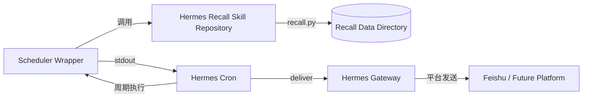

# Hermes Recall（回响）部署与运维

> 文档状态：Current + Target
>
> 状态核验日期：2026-08-10
>
> 当前产品基线：v1.0
>
> 当前数据 Schema：1.01

## 1. 文档目的

本文档定义 Hermes Recall 的安装、配置、数据目录、Scheduler、Gateway、Feishu 通道、健康检查、备份、恢复、升级、故障排查和发布维护流程。

本文档面向：

- 安装 Recall 的进阶个人用户；
- 维护本地长期运行环境的用户；
- Hermes Recall 项目维护者；
- 处理提醒投递和数据升级故障的运维人员。

本文档使用占位符描述通用流程，不公开真实用户数据、通知目标、Webhook、Token 或平台凭据。

## 2. 运维原则

### 2.1 代码、数据、配置和凭据分离

```text
Skill Repository
!= User Data Directory
!= Hermes Config
!= Secrets
```

- Skill Repository：代码、Skill 规范、文档和通用脚本；
- User Data Directory：Recall Records、History、View 和本地备用配置；
- Hermes Config：平台启用状态、Gateway 和 cron 设置；
- Secrets：App Secret、Token、Webhook 等敏感值。

### 2.2 JSON 是当前主数据事实来源

`recall.json` 是当前唯一事实来源。Markdown View 可以重新生成，不能用于覆盖主数据。

### 2.3 所有业务修改通过 CLI

不得直接手工修改：

- `recall.json`；
- `recall_history.json`；
- 自动生成的 Markdown View。

记录管理和 Schema upgrade 通过 `recall.py` 执行。

### 2.4 先备份，再升级

涉及 Schema、Migration、批量修改和存储迁移时，必须先生成可验证备份。

### 2.5 cron 执行成功不等于通知送达

需要分别检查：

- scheduler 脚本退出码；
- cron `last_status`；
- cron delivery error；
- Gateway 和平台状态；
- 必要时由用户确认真实收到。

### 2.6 通用流程优先

文档优先使用 Hermes CLI。Windows 计划任务、进程终止和绝对路径只作为平台适配或故障回退，不作为跨平台默认方式。

## 3. 术语与占位符

| 占位符 | 含义 |
|---|---|
| `<HERMES_HOME>` | 当前 Hermes profile 的实际根目录 |
| `<skill_dir>` | Hermes Recall Skill 仓库目录 |
| `<recall_dir>` | Recall 用户数据目录 |
| `<chat_id>` | 平台通知会话目标，示例中不使用真实值 |
| `<record_id>` | Recall Record ID |
| `<job_id>` | Hermes cron job ID |
| `<backup_dir>` | 本次备份目录 |
| `<version>` | Skill 发布版本 |

获取路径时优先使用：

```bash
hermes config path
hermes config env-path
```

不要假设所有用户都使用相同磁盘或目录。

## 4. 部署组成



运行链路：

1. Hermes Agent 调用 Skill 中的 `recall.py` 管理数据；
2. cron 周期执行 scheduler wrapper；
3. scheduler 调用 `send-reminders --quiet`；
4. 无到期 Reminder 时空输出；
5. 有到期 Reminder 时 stdout 作为消息交给 cron delivery；
6. Gateway 向 Feishu 等平台投递。

## 5. 前置条件

### 5.1 基础条件

- Hermes Agent 已安装；
- Python 3.10+；
- 可以运行 `hermes` CLI；
- 当前 Hermes profile 可写入 Skills 和数据目录；
- 需要通知时，目标平台已在 Hermes Gateway 中配置。

Recall 核心脚本使用 Python 标准库，不要求额外 Python 包。

### 5.2 检查 Hermes

```bash
hermes doctor
hermes config check
hermes skills list
```

若当前 Hermes 版本没有某个诊断命令，以 `hermes --help` 和官方文档为准。

### 5.3 检查 Python

```bash
python --version
python -m py_compile \
  <skill_dir>/scripts/recall.py \
  <skill_dir>/scripts/recall_scheduler.py \
  <skill_dir>/scripts/validate_recall.py
```

Windows 下调用 Windows Python 时，脚本路径优先使用 `E:/...` 形式，不将 MSYS `/e/...` 路径直接传给 Windows 可执行程序。

## 6. 安装 Skill

### 6.1 通过 Hermes Skill 机制

先搜索可用标识：

```bash
hermes skills search recall
```

安装：

```bash
hermes skills install <identifier>
```

安装后验证：

```bash
hermes skills list
```

### 6.2 通过 GitHub 仓库安装

如果注册源标识不可用，可将仓库克隆到当前 profile 的 Skill 目录：

```bash
git clone https://github.com/Vegetableadog/hermes-recall.git \
  <HERMES_HOME>/skills/productivity/hermes-recall
```

验证仓库文件：

```bash
git -C <skill_dir> status --short --branch
python <skill_dir>/scripts/recall.py --help
```

### 6.3 通过 SkillHub

SkillHub 的安装命令和 namespace 以发布页当前信息为准：

```bash
skillhub search hermes-recall
skillhub install hermes-recall --namespace <namespace> --dir <HERMES_HOME>/skills
```

安装后使用 `hermes skills list` 确认 Hermes 已识别。

### 6.4 安装验收

通过项：

- `SKILL.md` 可被 Hermes 识别；
- `recall.py --help` 正常输出；
- 三个 Python 脚本编译通过；
- 数据目录能够解析或创建；
- 未将用户数据打包进 Skill 仓库。

## 7. 数据目录

### 7.1 解析优先级

当前代码按以下顺序选择：

1. 环境变量 `HERMES_RECALL_DIR`；
2. Windows 既有兼容目录；
3. 用户主目录下的 `HermesData/recall`。

推荐显式配置 `HERMES_RECALL_DIR`，避免不同入口解析到不同目录。

### 7.2 数据目录内容

```text
<recall_dir>/
├── recall.json
├── recall_history.json
├── recall_view.md
├── config.json
└── optional-generated-views.md
```

职责：

- `recall.json`：当前主数据；
- `recall_history.json`：审计历史；
- `recall_view.md`：自动生成视图；
- `config.json`：当前 webhook 备用配置；
- 其他 Markdown：旧数据或按需生成视图。

### 7.3 数据目录权限

数据目录需要：

- 当前 Hermes/cron 运行账户可读写；
- 不允许不受信任用户访问；
- 不与公开 Git 仓库混放；
- 备份目录具有同等隐私保护；
- 云盘同步需评估凭据、冲突和历史版本风险。

### 7.4 首次初始化

运行只读命令可触发数据目录创建：

```bash
python <skill_dir>/scripts/recall.py list
```

首次运行后检查：

```bash
python <skill_dir>/scripts/validate_recall.py
```

若尚无 `recall.json`，Core 可以使用空数据结构；首次写入后才会保存主文件。

## 8. 基础配置

### 8.1 Hermes Config 与 Secrets

- 普通设置写入 Hermes `config.yaml`；
- 使用 `hermes config get/set/unset` 管理；
- 凭据存放在 Hermes `.env` 或受支持的秘密存储；
- 不把凭据写入 `config.yaml`；
- 不把普通设置伪装成 `.env` 变量。

查看路径：

```bash
hermes config path
hermes config env-path
```

### 8.2 不直接手工编辑 config.yaml

优先：

```bash
hermes config get <key>
hermes config set <key> <value>
hermes config unset <key>
```

手工缩进错误可能使 Hermes 无法读取配置。

### 8.3 `.env` 安全

`.env` 包含凭据：

- 不提交 Git；
- 不粘贴到文档、Issue 或测试报告；
- 修改前先备份；
- 修改后需要重启读取它的长期运行进程；
- 日志中只检查键是否存在，不打印完整值。

不要使用：

```bash
hermes config set env.SOME_SECRET value
```

这会写到错误的配置层，不会按预期修改 `.env`。

## 9. Feishu Gateway 配置

### 9.1 Setup

```bash
hermes setup gateway
```

选择 Feishu / Lark，按向导配置。平台凭据应保存到 Hermes Secrets 环境，不进入 Recall 数据。

### 9.2 启用平台

cron delivery 需要平台在 Hermes config 中启用：

```bash
hermes config set platforms.feishu.enabled true
hermes config get platforms.feishu.enabled
```

### 9.3 安装或启动 Gateway

安装后台服务：

```bash
hermes gateway install
```

检查：

```bash
hermes gateway status
```

前台诊断：

```bash
hermes gateway run
```

重启：

```bash
hermes gateway restart
```

不同 Hermes 版本和平台的 service 命令可能不同，以 `hermes gateway --help` 为准。

### 9.4 连接模式

当前本机已验证的 Feishu adapter 支持 `websocket` 和 `webhook`。如果日志报告 Unsupported mode，应以错误中列出的 supported modes 和当前官方文档为准，不盲目切换到 `long_connection`。

修改连接参数后，需要真正重启 Gateway，确认进程和日志出现新启动记录。

### 9.5 配对

当平台访问策略要求配对时：

1. 用户向机器人发送消息；
2. 机器人返回配对码；
3. 在可信终端批准：

```bash
hermes pairing approve feishu <PAIRING_CODE>
```

配对码和平台身份不写入公开文档。

## 10. Notification 目标

### 10.1 目标类型要区分

Hermes 独立发送命令和 cron delivery 可能使用不同的目标解析路径。不能假设 `hermes send` 可用的用户 ID 一定可以直接用于 cron。

Feishu cron 推荐使用明确的会话 `chat_id`：

```text
feishu:<chat_id>
```

不要在文档、提交或测试报告中写入真实 `<chat_id>`。

### 10.2 bare 平台名

```text
deliver=feishu
```

通常依赖 Gateway 进程中的 home channel 环境。它容易受到进程启动时间和环境加载影响。

生产 Reminder 推荐使用显式平台目标，减少手动运行与自然 tick 的环境差异。

### 10.3 测试平台连接

在明确使用合成测试文本并获得用户同意后：

```bash
hermes send --to feishu:<target> "Hermes Recall 通道测试"
```

`hermes send` 成功只证明独立发送路径可用，不证明 cron job 配置正确。

## 11. Scheduler 部署

### 11.1 通用 scheduler

Skill 仓库中的：

```text
<skill_dir>/scripts/recall_scheduler.py
```

使用当前 Python 解释器，并相对定位同目录的 `recall.py`，适合分发。

### 11.2 本机部署 scheduler

长期 cron 环境可以使用部署版 wrapper：

```text
<HERMES_HOME>/scripts/recall_scheduler.py
```

它可以固定：

- Python 解释器；
- `recall.py` 路径；
- Windows 路径格式。

部署版只能适配路径和解释器，不复制或改变 Reminder 业务规则。

### 11.3 创建 cron job

先查看当前 CLI：

```bash
hermes cron create --help
```

示例：

```bash
hermes cron create "every 15m" \
  "Hermes Recall 统一提醒调度器（no-agent，脚本驱动）" \
  --name "Hermes Recall 提醒 Scheduler" \
  --script recall_scheduler.py \
  --no-agent \
  --deliver feishu:<chat_id>
```

重要说明：

- `--script` 通常解析 `<HERMES_HOME>/scripts/` 下的脚本；
- `--no-agent` 表示不调用 LLM；
- stdout 非空时原样投递；
- stdout 为空时静默；
- 脚本非零退出时 cron 记录错误；
- `create` 是当前命令，部分版本支持 `add` 别名。

### 11.4 查看和管理

```bash
hermes cron list
hermes cron status
hermes cron runs <job_id>
hermes cron pause <job_id>
hermes cron resume <job_id>
hermes cron run <job_id>
hermes cron remove <job_id>
```

具体参数以对应 `--help` 为准。

### 11.5 调度频率

当前默认每 15 分钟检查一次。调整频率时考虑：

- 提醒允许的延迟；
- 系统开销；
- 平台频率限制；
- 进程启动成本；
- 用户打扰偏好。

不要为每条 Reminder 创建独立 cron job。

## 12. Scheduler 验收

### 12.1 静默检查

当前无到期 Reminder 时：

```bash
python <skill_dir>/scripts/recall.py send-reminders --dry-run
```

正常情况下不修改数据。实际 scheduler 在无到期事项时应空输出、退出 0。

### 12.2 手动 run 的边界

```bash
hermes cron run <job_id>
```

手动 run 可能在 CLI 会话环境执行，与 Gateway 自然 tick 的环境不同。若 CLI 会话早于 Secrets 或配置修改启动，手动 run 可能失败，而自然 tick 正常。

### 12.3 真实送达判定

需要逐层确认：

1. cron job 已启用；
2. `last_status` 正常；
3. delivery error 为空；
4. Gateway 平台连接正常；
5. 真实端到端测试时用户确认收到。

`Result: ok` 本身不是最终送达证据。

## 13. 日常操作

### 13.1 新增

```bash
python <skill_dir>/scripts/recall.py add \
  "虚构测试内容" \
  --category 生活日常 \
  --tags 测试,隔离
```

真实使用通常由 Hermes Agent 完成语义分析和命令调用。

### 13.2 查询

```bash
python <skill_dir>/scripts/recall.py list
python <skill_dir>/scripts/recall.py search <keyword>
python <skill_dir>/scripts/recall.py get <record_id>
python <skill_dir>/scripts/recall.py stats
```

### 13.3 状态

```bash
python <skill_dir>/scripts/recall.py done <record_id>
python <skill_dir>/scripts/recall.py update <record_id> --status 已归档
```

### 13.4 Reminder

取消：

```bash
python <skill_dir>/scripts/recall.py update \
  <record_id> \
  --reminder-status cancelled
```

恢复：

```bash
python <skill_dir>/scripts/recall.py update \
  <record_id> \
  --reminder-status pending
```

### 13.5 View

```bash
python <skill_dir>/scripts/recall.py view
python <skill_dir>/scripts/recall.py view --output daily.md
```

## 14. 健康检查

### 14.1 快速健康检查

```bash
hermes config check
hermes gateway status
hermes cron status
hermes cron list
python <skill_dir>/scripts/validate_recall.py
python <skill_dir>/scripts/recall.py due --json
```

### 14.2 分层判定

| 层级 | 检查 | 正常判定 |
|---|---|---|
| Code | Python 编译 | 退出 0 |
| Data | validator | 基础检查通过 |
| CLI | `recall.py --help` | 命令正常加载 |
| Scheduler | cron status/list | job 启用且可调度 |
| Runtime | 最近 run | `last_status` 正常 |
| Delivery | delivery error | 为空 |
| Gateway | gateway status/log | 进程运行且平台已连接 |
| E2E | 隔离测试 Reminder | 用户真实收到 |

### 14.3 当前 validator 边界

基础 validator 全绿不代表完整 Schema 已验证。它当前不覆盖全部字段类型、版本一致性、时间时区、History Contract 和 Config Contract。

完整测试要求见 `05-测试计划.md`。

## 15. 日志与诊断

### 15.1 Gateway 日志

日志通常位于：

```text
<HERMES_HOME>/logs/gateway.log
```

检查：

- 平台是否连接；
- 是否自动重连；
- 凭据错误或网络超时；
- inbound 消息；
- cron delivery 错误。

公开报告中需要脱敏身份、消息正文和凭据。

### 15.2 Cron 历史

```bash
hermes cron runs <job_id>
```

检查：

- 执行时间；
- 状态；
- 脚本错误；
- delivery error；
- 是否 `blocked_config`。

### 15.3 Recall History

`recall_history.json` 保存业务操作事件。它不是运行日志，也不是完整事件溯源数据库。

### 15.4 不记录什么

不要在 Issue、文档或公开日志中记录：

- 完整 `.env`；
- App Secret；
- Token；
- webhook；
- 真实 chat/user/open ID；
- 真实备忘录和客户信息；
- 未脱敏平台响应。

## 16. 备份

### 16.1 备份范围

最小备份：

- `recall.json`；
- `recall_history.json`；
- `config.json`，前提是备份位置按凭据等级保护；
- 必要的用户自定义 View；
- 当前 Skill 版本和 Schema 版本记录。

Gateway Secrets 应由 Hermes Secrets 备份策略单独处理，不与普通 Recall 数据备份混装。

### 16.2 备份时机

必须备份：

- Schema upgrade 前；
- Markdown Migration 前；
- 批量修改前；
- Storage Migration 前；
- 大版本升级前；
- 恢复测试前。

建议定期备份，频率由记录变化量和可接受数据损失窗口决定。

### 16.3 一致性备份流程

1. 暂停 Recall scheduler：

```bash
hermes cron pause <job_id>
```

2. 确认没有正在执行的 Reminder job；
3. 将整个 `<recall_dir>` 复制到带时间和版本标识的 `<backup_dir>`；
4. 生成并保存文件校验和；
5. 验证备份 JSON 可解析；
6. 恢复 scheduler：

```bash
hermes cron resume <job_id>
```

### 16.4 校验和

示例：

```bash
sha256sum \
  <backup_dir>/recall.json \
  <backup_dir>/recall_history.json \
  > <backup_dir>/SHA256SUMS

sha256sum -c <backup_dir>/SHA256SUMS
```

Windows 环境如果没有 `sha256sum`，使用等价的可信哈希工具。

### 16.5 备份验收

- 文件存在且大小合理；
- JSON 可解析；
- 校验和验证通过；
- 备份目录不在公开仓库；
- 备份可以在隔离目录完成恢复测试；
- scheduler 已恢复预期状态。

## 17. 恢复

### 17.1 恢复前原则

- 不直接覆盖唯一剩余副本；
- 先保存当前故障现场；
- 在隔离目录验证备份；
- 确认产品、Skill 和 Schema 兼容；
- 恢复期间暂停 scheduler。

### 17.2 恢复流程

1. 暂停 cron job；
2. 保存当前 `<recall_dir>` 为故障副本；
3. 创建临时恢复目录；
4. 将备份复制到临时目录；
5. 设置临时 `HERMES_RECALL_DIR`；
6. 运行 validator 和关键查询；
7. 核对 Record、History 和版本；
8. 确认无误后替换生产目录；
9. 再次运行 validator；
10. 恢复 scheduler；
11. 观察下一次自然 tick。

### 17.3 恢复验收

- 主数据可读；
- ID 无重复；
- History 可读；
- View 可重新生成；
- Reminder pending 状态符合预期；
- cron 不重复发送旧提醒；
- Gateway 正常；
- 用户确认关键记录存在。

## 18. Migration 与 Schema Upgrade

### 18.1 Markdown Migration

先 dry-run：

```bash
python <skill_dir>/scripts/recall.py migrate \
  --file <legacy_markdown> \
  --dry-run
```

确认预览后再执行：

```bash
python <skill_dir>/scripts/recall.py migrate \
  --file <legacy_markdown>
```

执行后：

```bash
python <skill_dir>/scripts/validate_recall.py
python <skill_dir>/scripts/recall.py view
```

注意：当前 Migration 对时间词使用启发式，可能需要人工校正 Reminder。

### 18.2 Schema Upgrade

升级前：

- 备份；
- 记录当前 Skill 和 Schema 版本；
- 暂停 scheduler；
- 在备份副本或隔离目录预演。

执行：

```bash
python <skill_dir>/scripts/recall.py upgrade
python <skill_dir>/scripts/validate_recall.py
```

当前 upgrade 不提供完整事务回滚，也不会修复全部非法字段。必须检查输出和测试报告。

### 18.3 版本记录

升级报告至少包含：

- 产品版本；
- Skill 版本；
- 升级前后 Schema；
- 被测 Git commit；
- 备份目录；
- dry-run 结果；
- validator 结果；
- 失败和回滚情况；
- 人工验收结论。

报告不记录真实内容和凭据。

## 19. Skill 更新

### 19.1 更新前

```bash
hermes cron pause <job_id>
git -C <skill_dir> status --short --branch
git -C <skill_dir> fetch origin
```

如有本地修改，先明确归属，不能直接丢弃。

### 19.2 更新代码

在工作区干净且确认分支后：

```bash
git -C <skill_dir> pull --ff-only
```

不要使用会覆盖本地修改的强制 reset。

### 19.3 更新后

```bash
python -m py_compile \
  <skill_dir>/scripts/recall.py \
  <skill_dir>/scripts/recall_scheduler.py \
  <skill_dir>/scripts/validate_recall.py

python <skill_dir>/scripts/validate_recall.py
python <skill_dir>/scripts/recall.py --help
```

如果 scheduler 调用的是仓库外部署版 wrapper，确认它仍指向正确代码路径。

恢复：

```bash
hermes cron resume <job_id>
```

观察自然 tick 和 delivery 状态。

## 20. Windows 本机部署适配

### 20.1 路径

Git Bash 中：

- shell 工具可以使用 `/e/...`；
- 传给 Windows Python 的路径使用 `E:/...`；
- 不依赖当前工作目录定位生产脚本。

### 20.2 Gateway 后台服务

优先：

```bash
hermes gateway restart
hermes gateway status
```

如果 Hermes CLI 无法真正替换旧的 direct-spawn 进程：

1. 通过 `hermes gateway status` 获取目标 PID；
2. 只终止该 PID；
3. 不使用 `taskkill /IM python.exe`；
4. 在 Git Bash 中调用 Windows `taskkill` 时禁用 MSYS 参数路径转换；
5. 重新启动已安装的 `Hermes_Gateway` 任务；
6. 验证 PID 变化和日志新启动记录。

示例只使用占位符：

```bash
MSYS_NO_PATHCONV=1 taskkill /F /PID <gateway_pid>
schtasks /Run /TN Hermes_Gateway
```

该流程属于故障回退，不是日常默认操作。

### 20.3 不要终止全部 Python

禁止：

```text
taskkill /F /IM python.exe
```

这可能同时终止 Hermes Agent、Gateway 和其他 Python 任务。

### 20.4 当前本机部署附录

当前维护环境使用：

- Hermes Home：`E:\HermesAgent`；
- Skill：`E:\HermesAgent\skills\productivity\hermes-recall`；
- Recall Data：`E:\HermesData\recall`；
- 本机 scheduler：`E:\HermesAgent\scripts\recall_scheduler.py`。

这些路径只描述当前维护环境，不属于其他用户的安装要求。

文档不记录当前 PID、真实通知目标、记录数量、运行时间或凭据。

## 21. 常见故障排查

### 21.1 Skill 未加载

检查：

```bash
hermes skills list
python <skill_dir>/scripts/recall.py --help
```

可能原因：

- 目录位置错误；
- `SKILL.md` frontmatter 无效；
- 安装到其他 profile；
- 当前 `HERMES_HOME` 与预期不同。

### 21.2 数据写到了错误目录

检查：

- 当前 `HERMES_RECALL_DIR`；
- Windows 兼容目录是否存在；
- 当前运行账户的 home；
- CLI、Gateway 和 cron 是否使用相同环境。

修复后不要直接合并两份 JSON。先备份并制定 Migration。

### 21.3 JSON 无法解析

症状：Core 或 validator 报 JSON decode error。

处理：

1. 暂停 scheduler；
2. 不覆盖故障文件；
3. 保存故障副本；
4. 使用最近备份在隔离目录验证；
5. 对比最后一次写入和 History；
6. 恢复后运行 validator。

### 21.4 Reminder 没有触发

检查顺序：

1. `needs_reminder` 是否为 true；
2. `reminder_status` 是否为 pending；
3. `remind_at` 是否合法且已到期；
4. 时区是否正确；
5. `due --json` 是否返回记录；
6. cron job 是否启用；
7. scheduler 脚本路径是否正确；
8. 最近 run 是否报错。

### 21.5 cron 成功但用户未收到

检查：

1. `last_status`；
2. delivery error；
3. 平台是否 enabled；
4. delivery 目标是否可解析；
5. Gateway 是否连接；
6. 真实目标类型是否正确；
7. 用户是否完成配对；
8. 平台侧是否拒绝消息。

如果 Record 已被提前标记 `sent` 而 delivery 失败，确认原因后手工重置：

```bash
python <skill_dir>/scripts/recall.py update \
  <record_id> \
  --reminder-status pending
```

重置前必须避免平台其实已经接受消息，否则可能重复发送。

### 21.6 平台未启用

错误类似：

```text
platform not configured/enabled
```

检查：

```bash
hermes config get platforms.feishu.enabled
```

按需设置：

```bash
hermes config set platforms.feishu.enabled true
```

### 21.7 delivery 目标无法解析

错误类似：

```text
no delivery target resolved
```

处理：

- 优先使用显式 `platform:<chat_id>`；
- 确认目标类型；
- bare 平台名时检查 Gateway 进程环境；
- 修改 Secrets/环境后真正重启 Gateway；
- 不把 `hermes send` 的目标解析结果直接当作 cron 目标。

### 21.8 Gateway 连接超时

处理：

1. 检查网络到平台域名；
2. 查看 Gateway 日志；
3. 等待自动重连；
4. 区分网络超时与鉴权失败；
5. 检查 adapter 支持的连接模式；
6. 修改后重启 Gateway；
7. 验证新进程和日志。

### 21.9 手动 run 失败，自然 tick 正常

可能原因：CLI 会话与 Gateway 进程加载了不同时间点的环境。

处理：

- 使用显式 delivery 目标；
- 重启读取 Secrets 的长期进程；
- 必要时重启 CLI 会话；
- 以 Gateway 自然 tick 作为生产路径验证。

### 21.10 View 与 JSON 不一致

重新生成：

```bash
python <skill_dir>/scripts/recall.py view
```

不要手工把 View 内容写回 JSON。

### 21.11 Schema upgrade 后 validator 失败

处理：

1. 保留失败现场；
2. 不继续写入；
3. 对照升级报告确定字段；
4. 在隔离备份中复现；
5. 使用 CLI 修复可修复字段；
6. 必要时执行恢复；
7. 为缺陷增加失败测试。

## 22. 安全检查清单

发布或运维变更前检查：

- [ ] Git 未跟踪 `recall.json`；
- [ ] Git 未跟踪 `recall_history.json`；
- [ ] Git 未跟踪 `.env`；
- [ ] 文档无真实 chat/user/open ID；
- [ ] 文档无 Token、Webhook 或 App Secret；
- [ ] 测试使用 synthetic 数据；
- [ ] 日志已脱敏；
- [ ] 备份不在公开目录；
- [ ] cron delivery 目标未出现在提交中；
- [ ] 发布包不含 `.git` 和本地配置；
- [ ] 恢复流程已经验证。

## 23. GitHub 维护

### 23.1 仓库

公开仓库：

```text
https://github.com/Vegetableadog/hermes-recall
```

本地 Skill 目录本身是 Git 仓库。

### 23.2 提交原则

- 每项文档或功能验收后独立提交；
- 不混入无关本地修改；
- 提交前运行 `git diff --check`；
- 提交前检查 staged 文件；
- 不提交用户数据和凭据；
- 推送后确认本地 `HEAD` 与 `origin/main` 一致。

示例：

```bash
git -C <skill_dir> status --short --branch
git -C <skill_dir> diff --cached --check
git -C <skill_dir> commit -m "docs: describe deployment and operations"
git -C <skill_dir> push origin main
git -C <skill_dir> rev-parse HEAD
git -C <skill_dir> rev-parse origin/main
```

### 23.3 本地未提交修改

发现未提交修改时：

- 先确认来源；
- 不擅自丢弃；
- 不使用破坏性 reset；
- 只 stage 当前任务文件；
- 必要时单独提交或保留。

## 24. SkillHub 发布

### 24.1 发布前

- 更新 `SKILL.md` frontmatter；
- 确认 `slug`、`displayName`、`version`；
- 更新 README 和 Changelog；
- 运行测试和隐私扫描；
- 确认 GitHub 已推送；
- 创建不含 `.git`、用户数据和本地配置的发布包。

### 24.2 平台兼容

当前维护经验表明 SkillHub 包可能需要排除不支持的文件类型，例如 LICENSE。以发布平台当前 dry-run 结果为准。

不得为了通过平台校验删除 GitHub 仓库中的 LICENSE；应只调整 SkillHub 发布包内容。

### 24.3 dry-run

```bash
skillhub publish --dry-run <package-or-skill-dir>
```

通过后再发布：

```bash
skillhub publish <package-or-skill-dir> \
  --changelog "<change-summary>"
```

### 24.4 发布后

- 检查平台版本；
- 检查安装包内容；
- 在隔离目录进行安装烟测；
- 确认 Hermes 可以识别；
- 记录发布结果；
- 平台索引可能存在同步延迟，不立即把搜索不到判定为失败。

## 25. 发布版本流程

### 25.1 发布前门禁

必须完成：

- 需求范围确认；
- 代码或文档验收；
- 自动化和人工测试；
- Migration/rollback 验证；
- 版本号确认；
- 隐私扫描；
- GitHub 提交；
- 发布说明。

### 25.2 三类版本

- 产品版本：用户能力阶段；
- Skill 版本：安装包发布版本；
- Schema 版本：持久数据结构版本。

只修改文档或安装说明时，不自动提升产品或 Schema 版本。

### 25.3 发布顺序

1. 本地测试；
2. 用户验收；
3. Git commit；
4. GitHub push；
5. GitHub 远端核验；
6. SkillHub dry-run；
7. SkillHub publish；
8. 安装烟测；
9. 发布记录。

## 26. 运维变更流程

任何影响生产 Reminder、Gateway 或数据的变更：

1. 定义变更目标；
2. 识别影响范围；
3. 备份；
4. 准备回滚；
5. 在隔离环境验证；
6. 暂停 scheduler；
7. 执行变更；
8. 运行健康检查；
9. 恢复 scheduler；
10. 观察自然 tick；
11. 必要时执行隔离端到端测试；
12. 记录结果。

真实平台测试需要用户明确同意。

## 27. 当前本机运行基线

截至状态核验日期，当前维护环境确认：

- Hermes Recall Skill 已安装；
- 数据目录存在并通过基础 validator；
- Gateway 后台服务已注册并运行；
- Feishu 平台已启用；
- Recall cron job 已启用；
- cron 使用 no-agent 脚本模式；
- 最近调度状态正常；
- 最近 delivery error 为空。

这些结论是状态快照，不保证未来持续健康。本文档不记录具体 PID、目标 ID、Record 数量或运行时间。

## 28. 目标运维能力（Target）

后续产品化需要增加：

- 一键健康检查；
- 自动备份和保留策略；
- 可验证恢复演练；
- Migration 自动备份、dry-run 和 rollback；
- Provider/Identity/Route 一致性检查；
- Delivery Attempt 诊断；
- 简明 Simple Mode 运维状态；
- 完整 Personal Mode 诊断；
- CI 和发布包自动检查；
- 多平台 Provider Contract Tests；
- 安全的 Secrets 管理和轮换流程。

这些能力完成实现和测试前保持 Target。

## 29. 运维验收清单

### 29.1 安装

- [ ] Skill 可识别；
- [ ] CLI 可运行；
- [ ] 数据目录正确；
- [ ] Python 编译通过；
- [ ] 用户数据未进入仓库。

### 29.2 Data

- [ ] validator 基础检查通过；
- [ ] 备份存在；
- [ ] 校验和通过；
- [ ] 隔离恢复测试通过；
- [ ] View 可重建。

### 29.3 Scheduler

- [ ] cron job 启用；
- [ ] no-agent 配置正确；
- [ ] 脚本路径正确；
- [ ] 无到期时静默；
- [ ] 错误时退出码可见。

### 29.4 Notification

- [ ] 平台 enabled；
- [ ] 目标可解析；
- [ ] Gateway 已连接；
- [ ] delivery error 为空；
- [ ] 真实测试时用户确认收到。

### 29.5 Release

- [ ] Git 提交范围正确；
- [ ] GitHub 已推送；
- [ ] SkillHub dry-run 通过；
- [ ] 发布包无用户数据和 Secrets；
- [ ] 安装烟测通过；
- [ ] 发布记录完整。

## 30. 当前结论

Hermes Recall v1.0 已具备可长期运行的本地数据、统一 Scheduler 和 Feishu 提醒链路，但当前运维仍依赖进阶用户理解 Hermes Config、Gateway、cron 和数据目录。

现阶段运维重点：

1. 保持代码、数据和凭据分离；
2. 为所有数据变更建立备份和恢复；
3. 分层判断 scheduler、cron、delivery 和真实送达；
4. 优先使用 Hermes CLI 管理配置和服务；
5. 保留 Windows 本机部署适配，但不把绝对路径变成通用要求；
6. GitHub 与 SkillHub 使用同一源码事实来源；
7. 不在公开文档和发布包中泄露用户数据或凭据。

一键健康检查、自动备份、可靠 rollback 和 Simple Mode 运维体验仍属于后续 Target。
