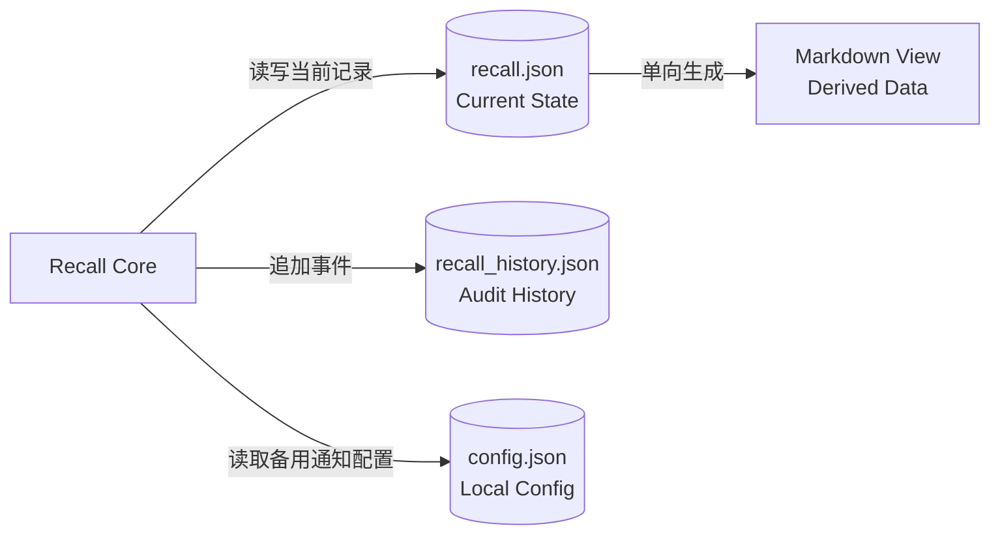
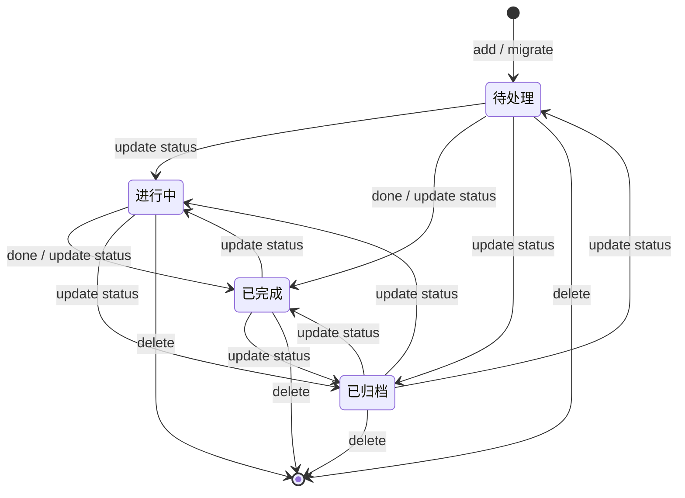
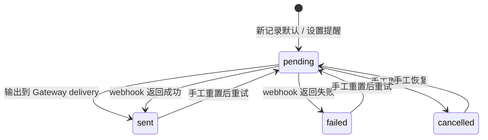

# Hermes Recall（回响）数据模型

> 文档状态：Current + Target
>
> 状态核验日期：2026-08-12（V1.1 校准）
>
> 适用产品基线：v1.1
>
> 当前数据 Schema 版本：2.0

## 1. 文档目的

本文档定义 Hermes Recall 当前数据文件、Recall Record、History Event、配置数据及其约束，并说明未来数据模型演进时必须遵守的兼容原则。

本文档同时描述：

- **Current**：当前源码实际创建、读取和校验的数据结构；
- **Target**：后续版本准备评估或实现的数据结构方向。

Current 与 Target 必须明确分开。原始设计稿中的字段若未出现在当前源码和当前主数据中，不属于现行 Schema。

本文档不直接修改 Schema，也不代替可执行校验器。Schema 发生变化时，必须同步更新源码、升级逻辑、测试和本文档。

## 2. 数据文件总览

Hermes Recall 当前使用四类数据文件：

| 文件 | 类型 | 是否事实来源 | 当前职责 |
|---|---|---:|---|
| `recall.json` | JSON | 是 | 保存当前有效 Recall Records 和 Schema 版本 |
| `recall_history.json` | JSON | 否 | 保存创建、更新、完成、删除和提醒事件 |
| `config.json` | JSON | 否 | 保存 webhook 备用通道配置 |
| `recall_view.md` / `daily.md` | Markdown | 否 | 由主数据生成的人类阅读视图 |

数据关系：



关键边界：

- `recall.json` 是当前记录状态的唯一事实来源；
- `recall_history.json` 是审计历史，不是当前状态的替代来源；
- Markdown View 是派生数据，可以重新生成；
- `config.json` 不得提交真实 webhook 或其他凭据到公开仓库。

## 3. Schema 版本规则（Current）

### 3.1 当前版本

当前数据 Schema 版本为字符串：

```json
"2.0"
```

版本同时出现在：

- `recall.json.version`；
- 每条 Recall Record 的 `schema_version`；
- 核心脚本的 `SCHEMA_VERSION` 常量。

当前约定要求三者保持一致。

### 3.2 与其他版本的区别

Schema 版本只描述数据结构，不等同于：

- 产品基线版本 `v1.0`；
- Skill 发布版本 `1.0.3`；
- 产品版本 `1.1`（V1.1 起 `recall.py --version` 统一显示产品/Skill/Schema 三版本）。

修改 README、发布渠道或不涉及存储结构的业务逻辑时，不需要自动提升 Schema 版本。

### 3.3 当前版本比较方式

核心脚本按点号拆分并转为整数元组进行比较：

```text
"2.0" → (2, 0)
```

因此当前实现把 `2.0` 与 `2` 视为相同的比较值。Schema 版本必须作为字符串存储，但未来确定新版本格式前，需要评估是否继续沿用这种比较方式。

### 3.4 Schema 变化条件

以下变化通常需要提升 Schema 版本：

- 新增必须持久化的 Record 字段；
- 删除或重命名现有字段；
- 字段类型发生变化；
- 枚举语义发生不兼容变化；
- Reminder 从扁平字段迁移到新结构；
- History Event Contract 发生需要迁移的变化；
- 主存储从 JSON 迁移到数据库且数据契约发生变化。

仅增加可选字段时是否提升版本，也应由迁移、兼容和测试要求决定，不能只看代码能否读取。

## 4. `recall.json` 顶层结构（Current）

### 4.1 结构示例

以下内容为虚构示例：

```json
{
  "version": "2.0",
  "recalls": [
    {
      "id": "recall_20260810_a1b2c3",
      "schema_version": "2.0",
      "content": "周五下午整理项目复盘材料",
      "category": "工作待办",
      "tags": ["项目", "复盘"],
      "needs_reminder": true,
      "remind_at": "2026-08-14T14:00:00+08:00",
      "reminder_status": "reminded",
      "status": "等待反馈",
      "priority": "normal",
      "created_at": "2026-08-10T10:00:00+08:00",
      "updated_at": "2026-08-10T10:00:00+08:00",
      "source": "user",
      "metadata": {},
      "memory": {"memory_type": "task", "importance": "normal", "entities": ["项目"], "related_ids": [], "waiting_for": "邹总"},
      "timeline": [{"date": "2026-08-10T10:00:00+08:00", "event": "创建回响"}],
      "parent_id": null
    }
  ]
}
```

### 4.2 顶层字段

| 字段 | 类型 | 必需 | 当前约束 |
|---|---|---:|---|
| `version` | string | 是 | 当前值为 `2.0` |
| `recalls` | array | 是 | 元素为 Recall Record；空库为 `[]` |

### 4.3 顶层不变量

- `version` 应与当前 `SCHEMA_VERSION` 一致；
- `recalls` 必须是数组；
- 每条有效记录必须具有唯一 `id`；
- 保存时使用 UTF-8 和格式化 JSON；
- 当前实现保存主数据时整体覆盖文件，不是追加写入。

当前 validator 尚未检查全部顶层不变量。它能成功运行不代表顶层 `version` 与每条记录的 `schema_version` 一定一致。

## 5. Recall Record（Current）

### 5.1 字段总表

当前源码创建的 Record 固定包含 15 个字段，另有 3 个 V1.1 可选字段（memory/timeline/parent_id）：

| 字段 | 类型 | 新记录必需 | 默认值 | 可通过 `update` 修改 | 说明 |
|---|---|---:|---|---:|---|
| `id` | string | 是 | 自动生成 | 否 | Record 稳定标识 |
| `schema_version` | string | 是 | `2.0` | 否 | 该记录对应的 Schema 版本 |
| `content` | string | 是 | 无 | 是 | 用户原始表达 |
| `category` | string enum | 是 | 语义判断或兜底分类 | 是 | 固定五分类之一 |
| `tags` | array[string] | 是 | `[]` | 是 | 搜索和主题辅助标签 |
| `needs_reminder` | boolean | 是 | `false` | 是 | 是否启用 Reminder |
| `remind_at` | string or null | 是 | `null` | 是 | ISO 8601 提醒时间 |
| `reminder_status` | string enum | 是 | `pending` | 是 | 当前 Reminder 状态（七状态，见 §5.9） |
| `status` | string enum | 是 | `待处理` | 是 | 记录/任务状态（五状态，见 §5.10） |
| `priority` | string enum | 是 | `normal` | 是 | 优先级 |
| `created_at` | string | 是 | 当前本地时间 | 否 | 创建时间 |
| `updated_at` | string | 是 | 当前本地时间 | 自动刷新 | 最近更新时间 |
| `source` | string | 是 | `user` | 否 | 记录来源 |
| `metadata` | object | 是 | `{}` | 否 | 扩展元数据容器 |
| `memory` | object or 缺失 | 否 | 无 | 是 | 结构化记忆子对象（V1.1，见 §5.16） |
| `timeline` | array or 缺失 | 否 | 无 | 是 | 演化时间线（V1.1，见 §5.17） |
| `parent_id` | string or null or 缺失 | 否 | 无 | 是 | 父回响 ID（V1.1，见 §5.18） |

这里的“新记录必需”表示当前 `add` 命令会写入该字段。它不表示 validator 已对全部字段执行严格验证。

### 5.2 `id`

当前新 ID 格式：

```text
recall_YYYYMMDD_随机6位hex
```

虚构示例：

```text
recall_20260810_a1b2c3
```

生成规则：

- 日期部分使用创建时的本地日期；
- 后缀由 3 个随机字节编码为 6 位十六进制字符；
- 生成时同时检查当前 Records 和 History Events 中已有 ID；
- 冲突时重新生成；
- 现有旧格式 ID，例如 `recall_YYYYMMDD_NN`，继续保留，不强制重写。

约束：

- 新 ID 由 Core 生成；
- 创建后不可修改；
- 删除 Record 后，History 中的同一 ID 仍被保留，因此后续不会复用。

### 5.3 `schema_version`

类型：string。

当前新记录固定写入 `1.01`。`upgrade` 会为缺失或低版本记录补齐当前版本。

约束：

- 不通过普通 `update` 修改；
- 不应使用数字类型保存；
- 应与记录实际结构相符，而不是只机械修改版本字符串。

### 5.4 `content`

类型：string。

语义：用户希望长期保存的原始表达。

约束：

- `add` 通过位置参数接收内容；
- AI 分类、标签或总结不得静默覆盖 `content`；
- 只有用户明确要求修改时，才通过 `update --content` 更新；
- 当前源码没有显式禁止空白字符串，也没有长度限制；这是现行校验缺口，而不是允许空内容的产品承诺。

### 5.5 `category`

类型：string enum。

允许值：

```text
工作待办
生活日常
想法灵感
学习笔记
收藏
```

规则：

- 正常流程由 Hermes 进行语义判断；
- 未显式传入时，Core 使用关键词启发式兜底；
- 无法判断时兜底为 `想法灵感`；
- `add` 和 `update` 会拒绝枚举外的值；
- validator 会检查当前主数据中的值是否合法。

### 5.6 `tags`

类型：array[string]。

当前行为：

- CLI 通过逗号分隔字符串接收；
- 写入前对每个标签执行首尾空白去除；
- 用于关键词搜索；
- 当前没有数量上限、长度上限、大小写规范和去重逻辑；
- 空参数通常写为 `[]`。

建议产品层继续使用 2 到 4 个高信息量标签，但这目前是 Agent 操作规范，不是 Core 的强制 Schema 约束。

### 5.7 `needs_reminder`

类型：boolean。

语义：该记录是否参与 Reminder 筛选。

默认值：`false`。

当前规则：

- `add` 只有收到合法 `--remind-at` 时才设为 `true`；
- `update --remind-at` 会自动设为 `true`；
- `update --needs-reminder true|false` 可以单独切换；
- validator 检查 `true` 时必须存在 `remind_at`。

当前源码允许出现：

```text
needs_reminder = false
remind_at = 非空历史时间
```

这可用于暂停 Reminder 并保留原时间，但当前文档和 CLI 尚未定义其正式产品语义。未来应在 Reminder 专项设计中明确。

### 5.8 `remind_at`

类型：string or null。

非空时应为 `datetime.fromisoformat` 可解析的 ISO 8601 字符串。推荐格式：

```text
2026-08-14T14:00:00+08:00
```

约束：

- 新建无提醒记录时为 `null`；
- 有提醒时必须包含可解析日期和时间；
- 当前 parser 接受 Python `datetime.fromisoformat` 支持的形式，并未强制要求时区；
- Agent 操作规范要求使用带时区格式；
- 到期判断会将其与本地 aware datetime 比较。

缺少时区的 datetime 虽可能通过解析，但在到期比较时可能引发 naive/aware datetime 类型错误。因此，带时区应提升为未来 validator 的强制约束。

### 5.9 `reminder_status`

类型：string enum。

允许值（V1.1 七状态，FR-002 五状态 + failed/cancelled 终态）：

```text
pending
reminded
waiting_response
completed
archived
failed
cancelled
```

当前语义：

| 值 | 当前含义 |
|---|---|
| `pending` | 等待到期检查或等待重新发送 |
| `reminded` | 已提醒（V1.1 起由 `sent` 迁移而来；Hermes 通道输出或 webhook 发送成功，不等同于平台确认送达） |
| `waiting_response` | 已提醒并等待用户回应（FR-002） |
| `completed` | 提醒生命周期完成 |
| `archived` | 提醒已归档 |
| `failed` | webhook 直发失败（V1.5 引入 Delivery 聚合后由 Attempt 判定替代，V1.1 保留终态不回头改数据） |
| `cancelled` | 手工取消 Reminder，不再参与 pending 筛选 |

重要约束：

- 非提醒记录当前也默认使用 `pending`，没有 `none` 枚举；
- 到期扫描只处理 `pending`；
- `reminded` 不是严格的 delivered 状态；
- v1→v2 迁移将旧值 `sent` 改写为 `reminded`（V1.1 切片 3）；
- 旧 History 快照可能保留过去使用过的 `sent` 与 `none`，但当前主数据不允许这两个值；
- validator 只校验主数据，不应直接套用于历史快照。

### 5.10 `status`

类型：string enum。

允许值（V1.1 五状态）：

```text
待处理
进行中
等待反馈
已完成
已归档
```

语义：

| 值 | 含义 |
|---|---|
| `待处理` | 尚未开始或未明确进入处理中 |
| `进行中` | 正在处理 |
| `等待反馈` | 等待外部反馈（FR-002/003）；与 `memory.waiting_for` 联动 |
| `已完成` | 已完成 |
| `已归档` | 从默认列表和视图中隐藏，但仍保留主数据 |

约束：

- 任务状态与 `reminder_status` 相互独立。`done` 只把 `status` 改为 `已完成`，不会自动取消尚未发送的 Reminder；
- `waiting_for` 联动：进入「等待反馈」时写入；离开时先由自动 timeline 事件固化、再清空（validator 双向约束：waiting_for 非空 ⇒ status=等待反馈；status=等待反馈时 waiting_for 可空）；
- 状态流转允许回头（如已完成→进行中），每次状态流转自动追加 timeline 事件（V1.1）。

### 5.11 `priority`

类型：string enum。

允许值：

```text
low
normal
high
```

默认值：`normal`。

当前 priority 用于记录和展示，尚未参与 Notification Routing 或 Scheduler 排序。

### 5.12 `created_at`

类型：string。

当前新记录使用本地时区的 ISO 8601 时间，精确到秒，例如：

```text
2026-08-10T10:00:00+08:00
```

约束：

- 创建后不可通过普通 update 修改；
- validator 检查字段存在，但尚未检查格式；
- 旧迁移数据可能曾使用非 ISO 时间，upgrade 会在字段缺失时补齐，但不会自动规范所有既有非空时间。

### 5.13 `updated_at`

类型：string。

当前新记录初始值与 `created_at` 接近。以下操作会刷新：

- `update`；
- `done`；
- Reminder 发送或状态变化。

当前 upgrade 在缺失时使用 `created_at` 或当前时间补齐。

### 5.14 `source`

类型：string。

当前常用值：

```text
user
migration
```

规则：

- `add` 默认写入 `user`；
- Markdown 迁移写入 `migration`；
- CLI 允许 `--source` 传入任意字符串；
- 当前没有固定枚举和 validator 约束。

如果未来需要增加 `import`、`api` 或其他来源，应先定义语义和兼容规则，不应依赖自由字符串进行关键业务判断。

### 5.15 `metadata`

类型：object。

默认值：`{}`。

当前用途：

- 迁移记录写入 `{"migrated_from": "markdown"}`；
- 为非核心扩展信息预留空间。

边界：

- 当前 CLI 不提供通用 metadata 更新参数；
- metadata 不是随意绕过 Schema 的容器；
- 会影响查询、提醒或兼容性的字段不应长期隐藏在 metadata；
- metadata 中不得存放 Token、Webhook 等凭据。

### 5.16 `memory`（V1.1 新增，可选）

类型：object or 缺失。

字段：

| 字段 | 类型 | 默认 | 说明 |
|---|---|---|---|
| `memory_type` | string enum | `unknown` | `task / idea / fact / preference / experience / unknown` |
| `importance` | string enum | `normal` | `low / normal / high` |
| `entities` | array[string] | `[]` | 非空字符串数组 |
| `related_ids` | array[string] | `[]` | 有效 Record ID 去重数组；悬空由 validator 报告，不自动修复（保留+报告策略） |
| `waiting_for` | string or 缺失 | 无 | 当前等待对象；与 status=等待反馈 联动（见 §5.10） |

边界：

- 缺失合法，读取不回写（V1.0 旧数据不因读取补默认值）；
- 仅显式提供参数时创建（`add`/`update` 的 --memory-type 等）；
- Hermes 可建议字段值，低置信度用默认/空值并说明（建议-不伪装策略）。

### 5.17 `timeline`（V1.1 新增，可选）

类型：array or 缺失。事件数组，每项 `{date, event}`：

- `date`：ISO 8601 带时区（强制）；
- `event`：事件文本；`result` 语义为附加说明/上下文（可承载结果、等待对象、备注、预期下一步），不强制"已完成事实"。

自动记录规则：

- 创建回响自动记录首事件「创建回响」；
- 每次状态流转自动追加事件（含离开等待反馈时的等待对象固化）；
- `update --timeline-event` 手动追加进展。

边界：缺失合法（V1.0 旧数据不伪造历史）；状态变化由代码自动追加，用户无需手动记录。

### 5.18 `parent_id`（V1.1 新增，可选）

类型：string or null or 缺失。指向父回响 ID，用于父子回响关系（FR-003：不覆盖原记录，建立关联）。

- 悬空 parent_id 由 validator 报告；
- 缺失合法。

## 6. 字段关系与不变量（Current）

### 6.1 当前由源码或 validator 强制的规则

- `category` 必须属于固定五分类；
- `status` 必须属于固定任务状态；
- `priority` 在 add/update 时必须属于固定枚举；
- `reminder_status` 通过 CLI 更新时必须属于固定枚举；
- `id` 在新建时检查唯一；
- `needs_reminder = true` 时 validator 要求 `remind_at` 非空；
- add/update 的 `remind_at` 必须能被 `datetime.fromisoformat` 解析；
- 普通 update 不能修改 `id` 和 `created_at`。

### 6.2 当前尚未被完整强制的规则

以下是期望约束，但当前 validator 尚未全部覆盖：

- 顶层 `version` 必须存在且等于当前 Schema；
- `recalls` 必须是数组；
- 每条 Record 必须包含全部 14 个字段；
- `schema_version` 必须存在且与结构一致；
- `content` 必须为非空字符串；
- `tags` 必须是字符串数组；
- `priority` 必须合法；
- `created_at`、`updated_at`、`remind_at` 必须是带时区 ISO 8601；
- `updated_at` 不应早于 `created_at`；
- `metadata` 必须是 object；
- `source` 必须是非空字符串；
- `needs_reminder` 必须是 boolean；
- `reminder_status` 与 `needs_reminder` 的完整组合语义必须一致。

这些缺口应进入测试计划和后续 validator 增强任务，但在完成实现前不能写成“当前已强制”。

### 6.3 Reminder 组合状态

当前有效且常见的组合：

| `needs_reminder` | `remind_at` | `reminder_status` | 当前解释 |
|---:|---|---|---|
| `false` | `null` | `pending` | 普通无提醒记录 |
| `true` | ISO 时间 | `pending` | 等待到期提醒 |
| `true` | ISO 时间 | `sent` | 已交付当前发送流程 |
| `true` | ISO 时间 | `failed` | webhook 发送失败 |
| `true` | ISO 时间 | `cancelled` | 已取消提醒 |
| `false` | ISO 时间 | 任一合法值 | Core 可读取，但产品语义尚未完全定义 |

以下组合当前应视为非法：

```text
needs_reminder = true
remind_at = null
```

## 7. Recall 生命周期（Current）



说明：

- 当前 Core 没有限制状态之间的转换顺序；
- `done` 是将任意存在记录设为 `已完成` 的快捷命令；
- `delete` 从主数据中移除 Record，但 History Event 继续保留；
- 归档不是删除。

## 8. Reminder 生命周期（Current）



当前限制：

- 状态转换没有独立领域服务强制；
- CLI 允许将合法枚举直接写入；
- 没有 `triggered`、`sending`、`delivered`、attempts 或 `last_error`；
- Gateway 的平台投递结果没有自动回写 Record；
- 自动 retry 尚未实现。

目标 Reminder 状态机由后续专项设计决定，本文档不提前把原始设计稿中的状态直接定为最终 Schema。

## 9. History Event（Current）

### 9.1 顶层结构

`recall_history.json` 当前结构：

```json
{
  "events": []
}
```

每个事件包含：

| 字段 | 类型 | 必需 | 说明 |
|---|---|---:|---|
| `event` | string | 是 | 事件类型 |
| `recall_id` | string | 是 | 对应 Record ID |
| `at` | string | 是 | 事件发生时间 |
| `detail` | object | 是 | 事件特定载荷 |

虚构示例：

```json
{
  "event": "done",
  "recall_id": "recall_20260810_a1b2c3",
  "at": "2026-08-10T11:00:00+08:00",
  "detail": {
    "before": "待处理",
    "after": "已完成"
  }
}
```

### 9.2 当前事件类型

当前实际使用 5 种事件：

```text
create
update
done
delete
remind_sent
```

### 9.3 `detail` Contract

| `event` | 当前 `detail` 可能包含 | 说明 |
|---|---|---|
| `create` | `content`, `category`, `source` | 普通新增与迁移新增的载荷略有差异 |
| `update` | `before`, `after`, `note` | 保存更新前后 Record；upgrade 可增加 note |
| `done` | `before`, `after` | 保存任务状态变化 |
| `delete` | `content` | 保存被删除记录的原内容 |
| `remind_sent` | `remind_at`, `channel` | 保存提醒时间；Gateway 模式可记录 channel |

当前 `detail` 没有独立 Schema 版本，且同一事件类型的键可能因调用路径不同而变化。消费 History 时必须按可选字段处理，不能假设每个事件载荷完全相同。

### 9.4 History 的兼容规则

History 是 append-only 风格的审计记录，可能保存旧 Schema 的 Record 快照。因此：

- `update.detail.before` 和 `after` 可能包含旧字段、缺失字段或旧枚举；
- 现行 Recall Record validator 不应直接校验历史快照；
- Schema upgrade 不应重写历史事实以伪装成新结构；
- History 中过去出现的非法现行值不等于当前主数据非法；
- 若未来需要机器稳定消费 History，应为 Event Contract 增加独立版本。

### 9.5 History 不是事件溯源数据库

当前系统不会仅凭 History 重建 `recall.json`，原因包括：

- `create` 事件不一定保存完整 Record；
- `delete` 事件只保存部分信息；
- 同类 detail Contract 不完全统一；
- 历史快照可能跨越多个旧 Schema。

因此，History 当前用于审计和追踪，不承担完整灾难恢复职责。

## 10. `config.json`（Current）

当前结构：

```json
{
  "feishu_webhook_url": ""
}
```

字段：

| 字段 | 类型 | 必需 | 说明 |
|---|---|---:|---|
| `feishu_webhook_url` | string | 是 | 空字符串表示使用 Gateway 输出模式；非空时使用 webhook 直发 |

安全约束：

- 真实 webhook 是敏感凭据；
- 不得提交到公开 GitHub 或 SkillHub 包；
- 文档和测试只能使用空值或明显虚构值；
- 未来统一 Notification Config 时，应评估凭据是否继续保存在数据目录 JSON 中。

`config.json` 不属于 `recall.json` Schema 1.01，但它属于当前本地运行数据契约。

## 11. Markdown View（Derived Data）

Markdown View 没有独立业务 Schema，其内容由 Core 根据当前 Records 生成。

约束：

- 可以删除后重新生成；
- 不作为 Record 恢复来源；
- 默认不显示 `已归档`；
- 内容格式变化通常不需要提升数据 Schema；
- View 格式变化可能需要更新快照测试或文档验收标准。

Migration 导入旧 Markdown 是单独的显式流程，不能把当前 View 当成可双向编辑的数据文件。

## 12. Migration 与 Upgrade（Current）

### 12.1 Markdown Migration

当前支持从旧 Markdown 导入 Record：

- 识别旧版日期标题和普通列表；
- 生成新 ID；
- 使用启发式分类；
- 写入 `source = "migration"`；
- 写入 `metadata.migrated_from = "markdown"`；
- 支持 dry-run。

已知边界：

- Migration 对时间词的判断是启发式；
- 可能产生 `needs_reminder = true` 但 `remind_at = null` 的中间数据；
- 迁移后需要人工或 Agent 补齐准确时间并运行 validator；
- Migration 不等同于完整 Schema upgrade。

### 12.2 Schema Upgrade

当前 `upgrade` 行为：

- 为缺失 ID 的记录生成 ID；
- 将缺失或低版本 `schema_version` 提升为当前版本；
- 为缺失 `created_at` 补当前时间；
- 为缺失 `updated_at` 补 `created_at` 或当前时间；
- 更新顶层 `version`；
- 对发生变化的记录写入 update History Event。

当前 upgrade 不会：

- 校验或修正全部枚举；
- 规范所有旧时间格式；
- 补齐全部 14 个字段；
- 修复 Reminder 组合状态；
- 自动备份文件；
- 提供事务回滚。

因此运行 upgrade 后仍应执行 validator，并在正式版本升级前准备数据备份。

## 13. 当前 Validator 覆盖范围

`validate_recall.py` 当前检查：

- JSON 可解析；
- ID 唯一；
- `created_at` 存在；
- `category` 合法；
- `status` 合法；
- `reminder_status` 合法；
- `needs_reminder = true` 时 `remind_at` 非空。

当前没有检查：

- 顶层版本一致性；
- Record 全字段存在；
- 字段类型；
- `priority`；
- 时间格式和时区；
- `schema_version`；
- `tags` 元素类型；
- `metadata` 类型；
- History Event Contract；
- Config Contract；
- 主数据与 History 的引用一致性。

因此，“validator 全绿”应解释为“当前基础检查通过”，不能解释为“完整 Schema 已被形式化验证”。

## 14. 原始设计与当前 Schema 的差异

v1.0 原始设计稿曾提出嵌套 Reminder：

```json
{
  "reminder": {
    "status": "pending",
    "channel": "feishu",
    "target": "",
    "attempts": 0,
    "last_error": null
  }
}
```

当前源码没有使用该结构，而是采用扁平字段：

```json
{
  "needs_reminder": true,
  "remind_at": "2026-08-14T14:00:00+08:00",
  "reminder_status": "pending"
}
```

因此：

- 嵌套 `reminder` 不是 Schema 1.01 的现行字段；
- `channel` 和 `target` 当前主要由 cron/Gateway 配置管理；
- `attempts` 和 `last_error` 尚未进入 Record；
- 未来是否采用嵌套 Reminder、独立 Reminder Entity 或 Delivery Entity，需要专项设计和迁移评审。

原始设计稿保留为 Historical 输入，不覆盖当前源码事实。

## 15. v1.1 结构化记忆方向（Target）

原始路线规划为 v1.1 增加：

- `memory_type`；
- `importance`；
- `entities`；
- `related_ids`。

这些字段目前尚未确定最终位置、类型和约束。至少需要回答：

### 15.1 `memory_type`

待确认：

- 是 Record 顶层字段，还是 `memory` 子对象字段；
- 是否固定为任务、想法、事实、偏好、经历；
- 与现有 `category` 如何分工；
- 是否允许一条记录具有多个 memory type。

### 15.2 `importance`

待确认：

- 使用 `low/normal/high`，还是数值评分；
- 与现有 `priority` 的区别；
- 是否影响召回排序；
- 是用户明确设置，还是 AI 建议值。

### 15.3 `entities`

待确认：

- 使用字符串数组还是结构化实体对象；
- 是否包含实体类型；
- 如何避免将敏感个人信息扩散到索引或日志；
- 实体名称变更时是否统一更新。

### 15.4 `related_ids`

待确认：

- 关系是单向还是双向；
- 删除目标 Record 后如何处理悬空引用；
- 是否需要关系类型和置信度；
- 自动发现关系是否需要用户确认。

在这些问题确认前，本文档不提前给出可执行 v1.1 Schema。

## 16. Notification 数据模型方向（Target）

未来 Notification Ecosystem 可能需要：

- Notification Identity；
- Delivery Target；
- Provider Config；
- Delivery Attempt；
- Delivery Result；
- Routing Rule；
- 幂等键；
- 错误分类和重试状态。

可能的方向包括：

1. 在 Recall Record 中扩展嵌套 `reminder`；
2. 将 Reminder 作为独立 Entity；
3. 将每次发送作为独立 Delivery Entity；
4. 保留 Record 中的轻量 Reminder 摘要，详细投递状态存入独立集合。

选型需要优先解决：

- 一条 Record 是否可以有多个提醒时间；
- 一个 Reminder 是否可以投递到多个渠道；
- Reminder 状态与 Delivery 状态如何分离；
- Gateway delivery 如何回写平台结果；
- 历史数据如何兼容；
- Simple Mode 如何隐藏这些复杂度。

该模型应在 `07-提醒与通知.md` 中正式设计，而不是在当前 Schema 文档中提前定案。

## 17. Storage 演进方向（Target）

### 17.1 JSON 阶段

继续适用于：

- 个人单用户；
- 数据规模较小；
- 低并发写入；
- 以可读、易备份和快速迭代为优先。

### 17.2 SQLite 阶段

迁移条件应由实际问题触发，例如：

- JSON 整体覆盖带来性能或可靠性问题；
- 需要稳定索引和复杂查询；
- 记录、Reminder、Delivery 和关系需要独立实体；
- 需要事务保证；
- 数据规模达到 JSON 不再合适的程度。

SQLite 迁移必须提供：

- dry-run；
- 迁移前备份；
- 记录数量和校验和核对；
- 失败回滚；
- Markdown View 兼容；
- 旧 JSON 保留策略；
- 可执行验收测试。

### 17.3 Vector Memory 阶段

Vector Memory 只作为检索辅助，不取代结构化主数据。

建议边界：

```text
Structured Store = 事实来源
Vector Index = 可重建的派生索引
```

向量索引损坏或删除后，应能从结构化数据重建。

## 18. 数据兼容与迁移原则

后续任何 Schema 变更必须遵守：

1. **保留原文**：不得丢失或静默改写 `content`；
2. **先备份**：迁移前保存可恢复副本；
3. **可预演**：提供 dry-run 或等价预检；
4. **版本明确**：迁移前后 Schema 版本可识别；
5. **幂等优先**：重复执行不应重复创建数据或破坏状态；
6. **历史诚实**：History 保留当时事实，不伪装成新版本数据；
7. **引用可核对**：关系和事件中的 Record ID 必须可检查；
8. **失败可恢复**：中途失败不能留下无法识别的混合状态；
9. **视图可重建**：Markdown 和向量索引等派生数据不参与主数据迁移判定；
10. **测试先行**：升级逻辑必须覆盖旧样本、异常样本和回滚验证。

## 19. 隐私与公开示例规则

数据模型文档与测试样本需要遵守：

- 只使用虚构 Record ID、内容、标签和时间；
- 不复制真实 `recall.json` 或 `recall_history.json` 到仓库；
- 不记录真实联系人、客户、组织或事务；
- 不记录 Feishu 身份、chat ID、Webhook、Token 或 API Key；
- History 示例不得来源于真实用户事件；
- 测试夹具应单独标明为 synthetic fixture；
- 公开错误日志必须脱敏。

## 20. Schema 1.01 验收基线

Schema 1.01 的当前验收基线是：

- `recall.json` 可被当前 Core 读取；
- 顶层包含 `version` 和 `recalls`；
- 当前新 Record 写入 14 个标准字段；
- Record ID 唯一；
- 分类、任务状态、优先级和 Reminder 状态使用当前枚举；
- 有效 Reminder 具有可解析的 `remind_at`；
- 主记录与 History 分开保存；
- Markdown View 由主数据单向生成；
- upgrade 不修改用户原始内容；
- validator 的基础检查通过；
- 用户数据和凭据不进入公开仓库。

其中部分规则目前依赖 Core 行为或人工核验，尚未全部由 validator 自动强制。需要在 `05-测试计划.md` 中把这些差距转化为明确测试用例，并在后续开发中逐步增强可执行校验。
