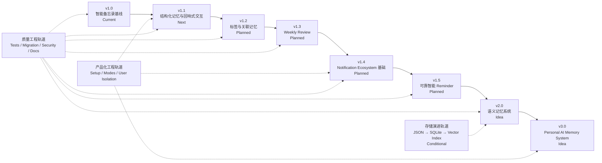

# Hermes Recall（回响）开发路线图

> 文档状态：Current + Target + Idea
>
> 状态核验日期：2026-08-10
>
> 当前产品基线：v1.0
>
> 下一候选产品版本：v1.1

## 1. 文档目的

本文档定义 Hermes Recall 从当前可运行基线向 Personal AI Memory System 演进的开发顺序、阶段目标、依赖关系、进入条件和完成标准。

本文档用于回答：

- 当前已经完成到哪里；
- 下一阶段应该解决什么问题；
- 哪些能力互相依赖；
- 什么条件满足后才能开始下一阶段；
- 什么结果可以认定某个版本完成；
- 哪些方向只是远期设想，尚未承诺实施。

路线图不是固定日期排期，也不是把原始设计稿中的所有想法自动转化为开发承诺。每个版本在进入实施前仍需确认需求、数据模型、风险和测试方案。

## 2. 路线图原则

### 2.1 真实使用优先

Recall 当前已经具备可用的记录和提醒闭环。后续开发应由真实使用反馈驱动，重点观察：

- 用户是否愿意持续输入信息；
- 哪类记录真正值得长期保存；
- 哪些提醒有价值；
- 哪些提醒造成打扰；
- 用户希望 Hermes 在什么场景主动召回信息；
- 当前数据量、查询方式和通知方式遇到了什么真实限制。

不能因为路线图中存在某项能力，就跳过验证直接实施。

### 2.2 数据安全优先于功能速度

任何涉及 Record、Reminder、History、Storage 或 Migration 的升级，都必须先解决：

- 原始内容保留；
- 旧数据兼容；
- 迁移前备份；
- dry-run 或等价预检；
- 失败恢复；
- 可执行验证。

### 2.3 先补契约，再扩展能力

优先明确数据模型、模块接口、状态语义和测试契约，再增加关联记忆、多平台通知或向量检索。

### 2.4 渐进拆分，不一次性重写

当前 `recall.py` 集中承担多个职责。后续应在保持现有 CLI 和数据兼容的前提下逐步提取模块，不以“架构更漂亮”为理由进行缺少用户价值和回归保障的大规模重写。

### 2.5 产品版本不等于发布时间

产品版本表达能力阶段，不承诺固定日期。进入下一个版本前，必须满足上一阶段的完成标准，并经过人工确认。

### 2.6 三类版本独立管理

- 产品版本：能力阶段，例如 `v1.1`；
- Skill 发布版本：安装包版本，例如 `1.1.0`；
- 数据 Schema 版本：数据结构版本，例如当前 `1.01`。

一个产品阶段可能包含多个 Skill 修订版；只有数据结构变化时才调整 Schema 版本。

## 3. 路线状态定义

本文档使用以下状态：

| 状态 | 含义 |
|---|---|
| **Current** | 当前源码和运行环境已经具备，并完成基础核验 |
| **Next** | 下一候选阶段，尚未开始正式实现 |
| **Planned** | 方向明确，但必须等待前置依赖和阶段评审 |
| **Conditional** | 只有触发条件成立才实施 |
| **Idea** | 远期设想，需要真实需求和技术验证 |
| **Deferred** | 已明确暂缓，不进入当前开发范围 |
| **Completed** | 已按完成标准实现、测试、文档化并验收 |

“文档已写”不等于“功能 Completed”。功能完成必须同时具备实现、迁移、测试、文档和人工验收。

## 4. 路线总览

说明：

- 主线版本表示产品能力递进；
- 产品化、质量和存储是贯穿多个版本的工程轨道；
- SQLite 和 Vector Memory 不因版本号自动实施；
- v1.4 补回原稿中已经存在的通知生态专项设计；
- v1.5 聚焦可靠 Reminder 和基于历史的提醒建议，不与 v1.4 的 Provider 基础重复。

## 5. 当前基线：v1.0（Current）

### 5.1 阶段定位

v1.0 是“可长期试用的智能备忘录与提醒闭环”，也是未来个人记忆系统的最小可靠基础。

### 5.2 已具备能力

- JSON 唯一事实来源；
- 固定五分类；
- Hermes 语义分类、标签和时间解析；
- Recall Record CRUD；
- 状态、优先级和标签；
- History Event；
- Markdown View；
- 旧 Markdown Migration；
- Schema upgrade；
- 统一 Scheduler；
- Feishu Gateway 提醒链路；
- webhook 备用通道；
- 基础数据 validator；
- GitHub 与 SkillHub 分发基础。

### 5.3 当前已知技术债

- `recall.py` 和 CLI 使用含义不明确的内部 `v2` 标识；
- Validator 未覆盖完整 14 字段 Contract；
- `remind_at` 尚未强制带时区；
- Gateway 模式的 `sent` 不等于平台确认送达；
- Reminder 没有 attempts、`last_error` 和自动 retry；
- History Event 的 `detail` Contract 不完全统一；
- Migration 可能产生需要二次校正的 Reminder；
- JSON 保存为整体覆盖，没有事务和原子替换设计；
- 当前搜索仅为关键词匹配；
- Core、Storage、Reminder 和 CLI 仍集中在一个脚本。

### 5.4 v1.0 维护策略

在 v1.1 正式开发前，v1.0 只接受：

- 阻断真实使用的缺陷修复；
- 数据安全问题修复；
- Reminder 漏发或错误状态修复；
- 安装、配置和发布问题修复；
- 文档和测试基线完善。

不在 v1.0 维护阶段提前加入大规模新功能。

## 6. v1.1：结构化记忆与回响式交互（Current，2026-08-12 已完成）

### 6.1 阶段目标

让 Recall 同时完成两项升级：

1. 从“保存记录”升级为“能表达记录属于什么记忆、涉及什么实体、重要程度如何，以及与哪些记录相关”；
2. 从机械的备忘录指令升级为具有“回响”辨识度、同时保持明确和安全的自然语言交互。

### 6.2 候选能力

- `memory_type`；
- `importance`；
- `entities`；
- `related_ids`；
- 结构化记忆的查询和展示；
- 对旧 Records 的兼容升级；
- `FEAT-V11-001` 回响式自然语言交互；
- 现有直白表达兼容；
- 歧义澄清与破坏性操作确认；
- 个人 Reminder 与系统轮询语义区分；
- 版本显示口径统一。

**实现状态（2026-08-12 校准）**：V1.1 已完成——8 个切片全部通过（107 项自动化测试全绿），生产数据已迁移至 Schema 2.0（22 条，备份在位），BUG-V11-001 已修复（Hermes Gateway 侧补丁，gateway 已重启生效）。候选能力中：memory 四字段、结构化查询展示、旧数据兼容升级、FEAT-V11-001 回响式交互、直白表达兼容、歧义确认、版本显示口径统一均已实现；个人 Reminder 与系统轮询语义区分按 V1.1 决策落地为「Reminder 七状态机 + 状态分层」（07 §10.1 投递层六状态标 V1.5 Target）。自动关联发现/主题聚合（FR-003 引擎）明确留 V1.3。

### 6.3 实施前必须确认的问题

1. `category` 与 `memory_type` 如何分工；
2. `priority` 与 `importance` 如何分工；
3. `entities` 是字符串还是结构化对象；
4. `related_ids` 是否需要关系类型、方向和置信度；
5. AI 生成字段是否需要用户确认；
6. 新字段是顶层字段还是 `memory` 子对象；
7. 旧数据如何补值，未知值如何表示；
8. 是否需要提升 Schema 版本；
9. 新字段如何进入 Markdown View、search 和 stats；
10. 敏感实体如何避免进入日志和公开测试样本；
11. Intent 结果的最小结构化 Contract；
12. 回响式表达与直白表达的兼容边界；
13. 低置信度、多目标和破坏性操作的确认规则；
14. 回响式反馈模板如何保持明确、简短且不改写原始 `content`。

### 6.4 FEAT-V11-001：回响式自然语言交互

| 项目 | 内容 |
|---|---|
| 状态 | Candidate；随产品 v1.1 进行范围冻结 |
| 用户价值 | 用具有“回响”辨识度的表达完成记录、查看、搜索、完成、归档、删除确认和 Reminder，同时不要求用户学习固定新语法 |
| 产品依据 | `06-产品需求.md` 中的 `FEAT-V11-001`、`PRD-FR-085` 至 `PRD-FR-095`、`PRD-UX-014` 至 `PRD-UX-019` |
| 架构依据 | `02-系统架构.md` 中 Target `Recall Intent Layer` |
| 数据影响 | 不新增第二事实来源；默认不改变 Recall 持久化 Schema |
| 兼容要求 | “记一下”“查看”“搜索”“完成”“删除”等现有直白表达继续可用 |
| 安全要求 | 删除、批量状态变更和多目标匹配必须经过明确确认；低置信度先澄清 |
| 测试要求 | 在 `05-测试计划.md` 建立 `V11-NLU` 专项回归后才进入实现 |

建议按以下垂直切片实施，每个切片均先写失败测试：

1. 新增与查看，只读和新增链路先闭环；
2. 搜索与目标解析；
3. 完成与归档，验证动作语义不混淆；
4. 删除确认和批量操作安全门；
5. Reminder 时间解析及系统轮询语义区分；
6. 回响式反馈模板与现有直白表达全量兼容回归。

该功能不要求一次实现任意诗意句子的开放式解析。V1.1 优先保证高频表达稳定、动作明确、失败可解释和危险操作可控。

### 6.5 工程治理任务

v1.1 同时处理以下已知问题：

- 移除或替换源码和 CLI 中含义不明确的内部 `v2`；
- 统一产品版本、Skill 版本和 Schema 版本的显示位置；
- 增强 validator，使其覆盖完整 Current Record Contract；
- 强制时间字段使用带时区 ISO 8601；
- 为 Schema Migration 增加备份、dry-run 和迁移后验证；
- 为新增字段建立合成测试夹具；
- 明确 History 是否需要独立 Event Schema Version；
- 修复 `BUG-V11-001`，确保同一次 Provider 重试耗尽只向 Feishu 发送一条最终错误提示。

#### BUG-V11-001：Feishu Provider 错误提示重复发送

| 项目 | 内容 |
|---|---|
| 状态 | 已修复（V1.1，2026-08-12）：conversation_loop.py 4 处终局 emit→_vprint，Hermes 侧 255 项回归全绿，gateway 已重启生效 |
| 发现阶段 | 产品 v1.0 真实使用 |
| 缺陷归属 | Hermes Agent Gateway 集成层，不属于 Recall 数据或业务逻辑 |
| 当前现象 | Provider 重试耗尽后，`status_callback` 与 `final_response` 可能各发送一条内容相同的脱敏错误提示 |
| 用户影响 | 用户可能误以为消息或任务被重复执行，Feishu 会话产生重复错误消息 |
| 已确认边界 | Feishu 入站消息未被重复消费；Provider 内部 retry 应保留；Recall 数据没有因此重复写入 |
| 修复方向 | 保留正式 `final_response`，抑制重试耗尽时语义相同的 `status_callback` 出站消息 |
| 回归用例 | `05-测试计划.md` 中的 `V11-GW-001` |

完成该缺陷修复时必须保留 Gateway 日志中的原始诊断信息，并继续对聊天表面隐藏 Provider 原始响应、请求标识和凭据。该任务不要求修改 Recall Schema，也不触发 Schema 版本提升。

### 6.6 进入条件

开始 v1.1 实现前必须满足：

- `01-项目总览.md` 已验收；
- `02-系统架构.md` 已验收；
- `03-数据模型.md` 已验收；
- `04-开发路线图.md` 已验收；
- `05-测试计划.md` 已定义 v1.1 数据迁移和回归测试；
- `FEAT-V11-001` 的 `V11-NLU` 失败测试、兼容测试和危险操作测试已定义；
- v1.1 数据模型经过单独评审并冻结；
- Recall Intent Layer 的最小输入、输出和确认 Contract 已评审；
- 当前用户数据已备份；
- v1.0 基础 validator 通过。

### 6.7 完成标准

v1.1 只有同时满足以下条件才算 Completed：

- 结构化记忆字段的最终 Contract 已确定；
- 新建、读取、更新、搜索和展示均支持新字段；
- 旧数据可通过明确迁移升级；
- Migration 支持预检、备份和失败恢复；
- 新旧数据 validator 全部通过；
- 现有 CRUD、Reminder、History 和 Markdown View 无回归；
- `FEAT-V11-001` 的新增、查看、搜索、完成、归档、删除确认和 Reminder 入口通过验收；
- 现有直白表达兼容回归通过；
- 低置信度、多目标、删除和批量操作不会擅自修改数据；
- 用户原始 `content` 不因回响式反馈被改写；
- 系统轮询机制不会被误创建为个人 Reminder；
- 版本标识不一致问题已修复；
- `BUG-V11-001` 已通过 `V11-GW-001`，同一次 Provider 重试耗尽只产生一条 Feishu 最终错误提示；
- 文档、CLI 帮助和 Skill 操作规范同步更新；
- 真实数据只在本机验收，不进入仓库；
- 用户完成阶段验收。

### 6.8 明确不包含

v1.1 不默认包含：

- Vector Memory；
- SQLite；
- 多平台通知；
- Weekly Review；
- 自动修改相关记录；
- 任意诗歌或完全依赖隐喻的开放式命令解析；
- 用户自定义完整表达词典；
- 用文学化内容改写用户原始记录；
- 为回响式交互单独建立持久化 Schema；
- 大规模 Core 重写。

## 7. v1.2：标签与关联记忆（Planned）

### 7.1 阶段目标

让孤立 Records 形成可查询、可解释的主题和关系网络。

### 7.2 候选能力

- 自动标签质量提升；
- 标签规范化和去重；
- 相关记录发现；
- 主题聚合；
- 按实体、主题和关系查询；
- 关系来源和置信度；
- 用户确认或撤销自动关系。

### 7.3 依赖

- v1.1 的 `entities` 和关系模型已稳定；
- 已有足够真实 Records 验证关联质量；
- 隐私边界明确；
- 查询结果能够解释“为什么相关”；
- 测试数据覆盖同义词、误关联和悬空引用。

### 7.4 完成标准

- 能查询与某条 Record 相关的 Records；
- 自动关系有明确来源或置信度；
- 用户可以拒绝错误关联；
- 删除或归档不会产生未处理的关系错误；
- 不通过关联流程静默修改用户原始内容；
- 关键词搜索继续可用；
- 关联查询具有可执行测试和人工质量评估。

## 8. v1.3：Weekly Review（Planned）

### 8.1 阶段目标

让 Hermes 对用户近期记录进行周期性总结，帮助用户观察关注主题、重复方向和未完成事项。

### 8.2 候选能力

- 按时间范围选择新增和更新 Records；
- 周度主题总结；
- 关注方向分析；
- 重复主题发现；
- 待处理事项摘要；
- 只读建议；
- 用户主动触发和可选周期触发。

### 8.3 安全边界

- Review 默认只读，不自动修改 Records；
- 不把模型总结写回 `content`；
- 建议与事实明确区分；
- 不向未配置的外部平台发送总结；
- 生成内容不得在公开日志中泄露用户数据；
- 用户可以关闭周期性 Review。

### 8.4 依赖

- v1.1 结构化字段稳定；
- v1.2 主题和关系查询达到可用质量；
- 时间范围查询可靠；
- 已定义总结数据来源和可追溯引用；
- 已明确 Review 的保存、删除和隐私策略。

### 8.5 完成标准

- Review 能准确引用来源 Records；
- 事实、统计、推断和建议清楚区分；
- Review 不修改主数据；
- 用户可手工触发、关闭或跳过；
- 空数据和少量数据场景行为明确；
- 有真实使用反馈证明总结具有价值。

## 9. v1.4：Notification Ecosystem 基础（Planned）

### 9.1 阶段目标

将当前以 Feishu 为主的通知路径升级为可扩展的 Notification Layer，但不要求一次接入所有平台。

### 9.2 核心范围

- Notification Provider Interface；
- Feishu 作为首个 Provider 实现；
- Notification Identity Layer；
- Delivery Result Contract；
- 统一 Notification Config；
- Gateway delivery 与 webhook 的职责归一；
- Provider 健康检查；
- 新 Provider 的开发和契约测试方式。

### 9.3 需要评估的范围

- 单提醒单渠道与多渠道 `delivery[]` 的兼容；
- category、priority、用户偏好的 Routing Strategy；
- 平台身份类型和默认目标；
- 凭据与普通配置的存储边界；
- 平台成功响应与实际送达的区别。

### 9.4 依赖

- Current Reminder Contract 已文档化；
- v1.0 投递确认窗口有明确修复方案；
- `07-提醒与通知.md` 完成专项设计；
- Config 和 Identity 不包含在 Recall Core 业务字段中；
- Feishu 回归测试可执行；
- Gateway 和 cron 的责任边界已经冻结。

### 9.5 完成标准

- Recall Core 不依赖 Feishu 特定发送逻辑；
- Feishu 通过统一 Provider Contract 工作；
- 当前用户无需迁移即可继续使用，或存在自动兼容层；
- Identity 和 Config Contract 已验证；
- Provider 失败返回统一结果；
- 新增第二个测试 Provider 不需要修改 Recall Core；
- 尚未实现的平台不会在 README 中宣称可用。

### 9.6 明确不要求

v1.4 不要求同时上线 Telegram、Email、Discord 和 Mobile Push。阶段目标是先稳定架构和 Feishu 兼容实现。

## 10. v1.5：可靠智能 Reminder（Planned）

### 10.1 阶段目标

把“按时间输出提醒”升级为具有可靠生命周期、可重试和可解释建议的 Reminder 系统。

### 10.2 可靠性范围

- 明确 Reminder 状态机；
- 区分 triggered、sending、accepted、delivered 或等价语义；
- Delivery Attempt；
- attempts；
- `last_error`；
- 自动重试策略；
- 幂等键；
- 防止重复发送；
- Gateway 投递结果回写；
- 死信或人工处理机制。

最终状态名称必须由专项设计确定，不能仅照搬原稿。

### 10.3 智能能力候选

- 根据历史完成情况提出提醒建议；
- 对重复忽略的提醒降低打扰；
- 根据用户偏好建议提醒时段；
- 对重要记录建议增加 Reminder；
- 明确区分“建议提醒”和“已创建提醒”。

AI 不能未经确认自动创建高打扰、多渠道或高频提醒。

### 10.4 依赖

- v1.4 Provider 和 Delivery Result Contract 稳定；
- Reminder 与 Delivery 已分离建模；
- 平台投递回执能力边界明确；
- 已具备时间可控的端到端测试环境；
- 已定义 retry 上限和幂等策略；
- 有真实提醒反馈可验证智能建议。

### 10.5 完成标准

- 不再把“脚本输出成功”直接等同于“平台送达”；
- 可追踪每次 Delivery Attempt；
- 可重试错误不会导致重复提醒；
- 不可重试错误有明确状态；
- 用户能取消、恢复和查看失败原因；
- 智能建议默认不静默修改 Reminder；
- 故障注入测试覆盖 Gateway、Provider、网络和平台失败。

## 11. v2.0：语义记忆系统（Idea）

### 11.1 阶段目标

让 Recall 能根据含义和上下文召回相关历史信息，而不只依赖精确关键词。

### 11.2 候选能力

- 语义检索；
- 混合搜索：关键词 + 结构化过滤 + Vector Search；
- 可解释召回；
- 时间、实体、主题和重要程度联合排序；
- 上下文相关的主动 Recall 候选；
- 可重建的向量索引。

### 11.3 进入条件

- 真实数据量和查询需求证明关键词搜索不足；
- v1.1-v1.3 的结构化数据和关系质量稳定；
- 已明确 Embedding Provider、成本、隐私和离线策略；
- 向量索引被定义为可重建派生数据；
- 有语义检索评测集和可接受质量指标；
- 用户可以查看召回来源并纠正错误。

### 11.4 完成标准候选

- 语义召回质量优于仅关键词基线；
- 结果可追溯到原始 Records；
- 向量索引损坏后可重建；
- 删除 Record 后对应索引可清理；
- 敏感数据处理符合用户配置；
- 无 Vector 服务时仍可降级到结构化和关键词搜索。

v2.0 目前是 Idea，不是承诺版本。

## 12. v3.0：Personal AI Memory System（Idea）

### 12.1 阶段目标

将 Recall 从工具升级为可安装、可配置、可扩展的个人 AI 长期记忆系统。

### 12.2 候选能力

- Setup Wizard；
- Simple Mode；
- Personal Mode；
- 用户隔离；
- 多平台通知；
- 长期记忆、关系、Review 和语义召回统一体验；
- 主动但可控的 Recall；
- 可导出、可迁移、可删除的数据所有权；
- 健康检查和恢复工具；
- 面向普通用户隐藏内部技术概念。

### 12.3 进入条件

- 前序能力经过真实长期使用；
- 数据安全、通知可靠性和隐私边界稳定；
- Simple Mode 的最小配置可以定义；
- 多用户隔离模型经过安全评审；
- 安装、升级、备份和恢复流程可重复；
- 产品需求文档已经完成并经用户验收。

v3.0 目前是长期方向，不提前冻结功能范围。

## 13. 产品化工程轨道

产品化不是只在最后一个版本发生，而应渐进推进。

### 13.1 第一阶段：开发者可维护

- 正式项目文档；
- 清晰版本体系；
- 可执行 validator；
- GitHub 单一维护源；
- GitHub 与 SkillHub 发布同步；
- 配置和数据分离；
- 故障排查资料。

### 13.2 第二阶段：高级用户可安装

- 明确安装命令；
- 默认数据目录；
- 可选 Gateway 配置；
- 健康检查；
- 备份和升级工具；
- Personal Mode 配置。

### 13.3 第三阶段：普通用户可使用

- Setup Wizard；
- Simple Mode；
- 默认安全配置；
- 隐藏 Provider、Identity、Schema 和 Migration；
- 清晰错误提示；
- 一键导出和恢复。

### 13.4 第四阶段：多用户或多实例

只有出现真实需求后才评估：

- 用户隔离；
- 数据目录隔离；
- 配置隔离；
- 通知身份隔离；
- 权限和访问控制；
- 多实例升级策略。

## 14. 存储演进轨道（Conditional）

### 14.1 当前：JSON

继续使用 JSON，直到真实问题证明需要迁移。

需要持续观察：

- Record 数量；
- 文件大小；
- 读写耗时；
- 整体覆盖失败风险；
- 查询复杂度；
- 并发写入需求；
- Reminder、Delivery 和关系是否需要独立实体。

### 14.2 SQLite 触发条件

满足下列一项或多项后进入正式评估：

- JSON 读写性能影响实际使用；
- 整体覆盖带来不可接受的损坏风险；
- 需要事务和原子多实体更新；
- 需要可靠索引和复杂组合查询；
- Reminder、Delivery、Relations 已无法合理放在单文件结构中；
- 数据规模达到经实测确认的迁移阈值。

原稿提出的 `0-5000`、`5000-50000` 条区间可以作为观察参考，但不是未经实测即可执行的硬阈值。

### 14.3 Vector Index 触发条件

- 用户真实查询经常无法通过关键词和结构化过滤完成；
- 已有可评测的语义检索样本；
- 隐私和 Embedding 策略明确；
- 结构化主存储稳定；
- 索引可完全重建。

## 15. 质量工程轨道

每个产品版本都必须同步完成：

- 需求边界确认；
- 数据模型评审；
- 架构影响评估；
- 自动化测试；
- Migration 测试；
- 回归测试；
- 隐私扫描；
- 文档更新；
- 发布版本确认；
- 人工验收。

### 15.1 阶段门禁

任何涉及持久数据的版本都不能跳过 Migration 和人工验收。

## 16. 优先级规则

任务优先级从高到低：

1. 数据丢失、泄密或凭据暴露；
2. Reminder 漏发、重复发送或错误状态；
3. 旧数据无法读取或升级失败；
4. 核心 CRUD 和查询故障；
5. 安装、配置和发布阻断；
6. 测试、validator 和文档缺口；
7. 已验证的新产品能力；
8. 尚无真实需求支撑的远期优化。

功能版本开发期间出现更高优先级问题时，应暂停新功能并先处理阻断项。

## 17. 暂缓事项（Deferred）

当前明确暂缓：

- 同时开发全部通知平台；
- 未经评测直接引入 Vector Database；
- 仅为分层美观重写全部 `recall.py`；
- 在没有多用户需求时开发复杂权限系统；
- AI 未经确认自动修改原始内容；
- AI 未经确认自动创建高频或多渠道 Reminder；
- 把 Markdown View 升级为第二事实来源；
- 仅按记录条数机械迁移 SQLite；
- 在公开仓库提交真实用户数据或通知凭据。

## 18. 路线变更流程

路线图不是不可修改，但变更需要可追踪。

### 18.1 可以触发变更的情况

- 真实使用反馈否定当前优先级；
- 数据安全或通知可靠性问题；
- Hermes Runtime 或 Gateway 能力变化；
- 新平台产生明确需求；
- 技术验证证明原方案不可行；
- 前置阶段无法满足预定完成标准。

### 18.2 变更要求

- 说明变更原因；
- 标明受影响版本和文档；
- 重新评估 Schema、Migration 和测试；
- 重大架构取舍写入 ADR；
- 不删除 Historical 设计依据；
- 经用户确认后更新路线状态。

## 19. 近期执行顺序

正式项目文档、ADR 和 Historical archive 已完成基础建设。当前阶段正在将以下 V1.1 变更作为一个文档单元验收：

1. `06-产品需求.md`：定义 `FEAT-V11-001` 产品行为与范围；
2. `02-系统架构.md`：定义 Target `Recall Intent Layer`；
3. `04-开发路线图.md`：定义 V1.1 候选范围、依赖和完成标准；
4. `05-测试计划.md`：定义 `V11-NLU` 与 `V11-GW-001` 回归和门禁。

该文档单元验收后，下一工程步骤是：

1. 建立隔离的 `tests/` 基础设施；
2. 建立 v1.0 Characterization Tests；
3. 为 `BUG-V11-001` 执行 `V11-GW-001` 并保存 RED 证据；
4. 为 `FEAT-V11-001` 的第一个垂直切片执行 `V11-NLU` 并保存 RED 证据；
5. 完成数据 Contract、Intent Contract、备份和回滚评审；
6. 经用户确认后，才将 v1.1 从 Next 调整为 In Progress。

在上述准入条件满足前，不开始 v1.1 生产代码开发。

## 20. 下一决策点

完成并验收前五份核心文档后，需要单独确认：

1. 是否正式启动 v1.1；
2. 是否先完成 PRD 再冻结 v1.1 范围；
3. `memory_type`、`importance`、`entities`、`related_ids` 的最终 Contract；
4. v1.1 是否提升 Schema 版本；
5. v1.1 对 Skill 发布版本的目标；
6. 是否在 v1.1 同步增强 History Event Contract；
7. 是否先建立测试夹具与备份恢复能力，再修改生产数据。

在这些决策完成前，v1.1 保持 Next，而不是 In Progress。
